# SRS - Sistema de Gestión de Horarios

## 1. Introducción

### 1.1 Propósito
Este documento de Especificación de Requisitos de Software (SRS) describe las especificaciones funcionales y no funcionales para el Sistema de Gestión de Horarios. El propósito es proporcionar una descripción detallada del sistema que servirá como base para el desarrollo, pruebas y validación del proyecto.

### 1.2 Alcance
El Sistema de Gestión de Horarios Escolares es una aplicación especializada diseñada para la confección automática de horarios académicos de un centro educativo. El sistema está específicamente orientado a:

**Contexto del Centro Escolar:**
- **3 niveles educativos** con diferentes programas académicos
- **3 clases por nivel** (9 clases en total)
- **25 alumnos por clase** (225 estudiantes en total)
- **Jornada escolar**: 5 horas diarias de clase
- **Duración de clases**: 55 minutos cada una
- **Descanso**: 20 minutos después de las 2 primeras clases

**Funcionalidades principales:**
- Generar horarios escolares automáticamente cumpliendo todas las restricciones pedagógicas
- Gestionar la asignación de profesores a asignaturas y niveles
- Distribuir las horas semanales de cada asignatura de forma equilibrada
- Evitar conflictos de profesores, aulas y grupos
- Visualizar horarios por clase, profesor y aula
- Generar reportes de carga horaria y distribuciones
- Permitir ajustes manuales con validación de restricciones

### 1.3 Definiciones, Acrónimos y Abreviaturas
- **SRS**: Software Requirements Specification (Especificación de Requisitos de Software)
- **UI**: User Interface (Interfaz de Usuario)
- **API**: Application Programming Interface
- **CRUD**: Create, Read, Update, Delete
- **Nivel educativo**: Curso o grado académico (ej: 1º, 2º, 3º)
- **Clase/Grupo**: Subdivisión de un nivel (A, B, C)
- **Asignatura**: Materia o disciplina académica
- **Período/Sesión**: Bloque de tiempo de 55 minutos para una clase
- **Slot horario**: Espacio de tiempo asignable en la semana
- **Carga horaria**: Total de horas semanales asignadas a un profesor o asignatura
- **Conflicto**: Solapamiento imposible de recursos (profesor, aula, grupo)
- **Restricción dura**: Regla que no puede violarse bajo ninguna circunstancia
- **Restricción blanda**: Regla deseable pero no obligatoria

### 1.4 Referencias
- IEEE Std 830-1998: IEEE Recommended Practice for Software Requirements Specifications

### 1.5 Visión General
Este documento está organizado en las siguientes secciones:
- Descripción general del sistema
- Requisitos funcionales
- Requisitos no funcionales
- Casos de uso
- Interfaz de usuario
- Restricciones y supuestos

---

## 2. Descripción General

### 2.1 Perspectiva del Producto
El Sistema de Gestión de Horarios es un producto independiente que puede integrarse con sistemas externos mediante APIs. Funcionará como una aplicación web accesible desde navegadores modernos y dispositivos móviles.

### 2.2 Funciones del Producto
Las principales funciones incluyen:
- **Gestión de Horarios**: Crear, modificar, eliminar y visualizar horarios
- **Gestión de Usuarios**: Administrar perfiles y permisos
- **Gestión de Recursos**: Asignar salas, equipos o personas a slots de tiempo
- **Notificaciones**: Alertas automáticas de cambios o recordatorios
- **Reportes**: Generación de informes y estadísticas
- **Sincronización**: Exportar/importar horarios a formatos estándar (iCal, CSV)

### 2.3 Características de los Usuarios

| Tipo de Usuario | Descripción | Permisos |
|-----------------|-------------|----------|
| Director/Administrador | Gestiona el sistema, aprueba horarios finales | Acceso total, configuración académica |
| Coordinador Académico | Genera y modifica horarios, asigna profesores | CRUD de horarios, gestión de profesores |
| Profesor | Visualiza su horario personal y el de sus clases | Consulta de horarios, registro de preferencias |
| Estudiante/Padre | Consulta horarios de clases | Solo lectura de horarios públicos |

### 2.4 Restricciones Generales
- El sistema debe funcionar en navegadores modernos (Chrome, Firefox, Safari, Edge)
- Debe ser responsive para dispositivos móviles
- Cumplir con normativas de protección de datos (GDPR, LOPD)
- Disponibilidad del 99.5% mensual
- Backend desarrollado en .NET 8
- Base de datos: MSSQL Server en Docker
- Frontend: HTML, CSS y Bootstrap
- Visualización de horarios mediante tablas HTML/Bootstrap

### 2.5 Suposiciones y Dependencias
- Los usuarios tienen acceso a internet
- Los usuarios tienen conocimientos básicos de navegación web
- El sistema tendrá un servidor con capacidad adecuada
- Las integraciones externas estarán disponibles según SLA acordados
- El centro cuenta con suficientes aulas para todas las clases simultáneas
- Los profesores tienen título habilitante para las asignaturas que imparten

### 2.6 Reglas de Negocio del Centro Escolar

#### 2.6.1 Estructura Académica

**Niveles y Grupos:**
- 3 niveles educativos (Nivel 1, Nivel 2, Nivel 3)
- 3 clases por nivel: Clase A, Clase B, Clase C
- 25 alumnos por clase
- **Total**: 9 grupos diferentes

**Plan de Estudios - Horas semanales por asignatura:**

| Asignatura | Horas/Semana | Períodos de 55 min |
|------------|--------------|--------------------|
| Matemáticas | 4 | 4 |
| Inglés | 3 | 3 |
| Historia | 4 | 4 |
| Lengua Española | 4 | 4 |
| Educación Física | 1 | 1 |
| Manualidades | 2 | 2 |
| Física y Química | 4 | 4 |
| Ética | 2 | 2 |
| **TOTAL** | **24** | **24** |

#### 2.6.2 Jornada Escolar

**Estructura Diaria:**
- **Horas de clase por día**: 5 períodos
- **Duración de cada período**: 55 minutos
- **Descanso**: 20 minutos después del 2º período

**Distribución horaria típica:**
```
Período 1: 08:00 - 08:55
Período 2: 09:00 - 09:55
DESCANSO: 09:55 - 10:15 (20 minutos)
Período 3: 10:15 - 11:10
Período 4: 11:15 - 12:10
Período 5: 12:15 - 13:10
```

**Semana lectiva**: 5 días (Lunes a Viernes)
**Total períodos semanales por grupo**: 25 períodos (5 días × 5 períodos)

#### 2.6.3 Restricciones de Profesores

**Carga Docente:**
- **Máximo de horas semanales por profesor**: 20 horas
- **Máximo de asignaturas diferentes por profesor**: 2
- **Prioridad**: Asignar la misma asignatura en todos los niveles siempre que sea posible
- **Preferencia**: Minimizar la fragmentación de horarios de profesores

**Ejemplo de asignación válida:**
- Profesor A: Matemáticas en Nivel 1, 2 y 3 (12 horas) + Física y Química en Nivel 1 (4 horas) = 16 horas
- Profesor B: Inglés en todos los niveles (9 horas) + Ética en Nivel 2 y 3 (4 horas) = 13 horas

**Cálculo de profesores necesarios:**
- Total horas semanales del centro: 24 horas × 9 grupos = 216 horas
- Con límite de 20 horas/profesor: **mínimo 11 profesores**

#### 2.6.4 Restricciones Duras (Obligatorias)

1. **No solapamiento de profesores**: Un profesor no puede estar en dos lugares a la vez
2. **No solapamiento de grupos**: Un grupo solo puede tener una clase simultáneamente
3. **No solapamiento de aulas**: Una aula solo puede ser usada por un grupo a la vez
4. **Cumplimiento de horas semanales**: Cada grupo debe tener exactamente las horas definidas de cada asignatura
5. **Límite de carga docente**: Ningún profesor puede superar 20 horas semanales
6. **Límite de asignaturas**: Ningún profesor puede impartir más de 2 asignaturas diferentes
7. **Descanso obligatorio**: El período de descanso debe estar después del 2º período
8. **5 períodos diarios**: Cada grupo debe tener exactamente 5 clases por día

#### 2.6.5 Restricciones Blandas (Deseables)

1. **Distribución equilibrada**: Las horas de una asignatura deben distribuirse uniformemente en la semana
2. **Evitar huecos**: Minimizar períodos libres en el horario de profesores
3. **Materias pesadas temprano**: Matemáticas, Física y Química preferentemente en períodos 1, 3 o 4
4. **Educación Física no al final**: Preferentemente en períodos 3, 4 o 5 para evitar el primer período
5. **Continuidad de profesor**: Si un profesor imparte dos asignaturas, agruparlas en días consecutivos
6. **Variedad diaria**: Evitar que un grupo tenga la misma asignatura dos veces el mismo día (excepto si tiene >5 horas/semana)

### 2.7 Arquitectura Técnica

#### 2.7.1 Stack Tecnológico

**Backend:**
- **Framework**: .NET 8 (LTS)
- **Lenguaje**: C# 12
- **Arquitectura**: Web API RESTful
- **Patrón**: Repository Pattern + Service Layer
- **ORM**: Entity Framework Core 8
- **Autenticación**: ASP.NET Core Identity con JWT

**Base de Datos:**
- **Motor**: MSSQL Server 2022 en contenedor Docker
- **Desarrollo**: Instancia Docker local (puerto 1433)
- **Testing**: SQL Server en Docker o In-Memory Database para pruebas unitarias
- **Producción**: Contenedor Docker SQL Server con volúmenes persistentes
- **Migraciones**: Entity Framework Core Migrations
- **Versionado**: Control de versiones de esquema con Code-First
- **Configuración Docker**: docker-compose.yml para orquestación
- **Persistencia**: Volúmenes Docker para datos y logs

**Frontend:**
- **Marcado**: HTML5
- **Estilos**: CSS3 + Bootstrap 5.3
- **JavaScript**: Vanilla JS o jQuery para interactividad
- **Visualización**: Tablas Bootstrap con responsive design
- **Grid de horarios**: Tabla HTML con clases Bootstrap (table, table-bordered, table-hover)

**Testing:**
- **Unit Tests**: xUnit o NUnit
- **Mock Framework**: Moq para abstracciones de datos
- **In-Memory Database**: Entity Framework Core In-Memory para pruebas de integración
- **Cobertura**: Mínimo 80% en lógica de negocio y algoritmos

#### 2.7.2 Arquitectura de Aplicación

**Capas de la Aplicación:**

```
┌─────────────────────────────────────────────┐
│         Capa de Presentación                │
│     (HTML + CSS + Bootstrap + JS)           │
└─────────────────┬───────────────────────────┘
                  │ HTTP/REST
                  ▼
┌─────────────────────────────────────────────┐
│         Capa de API Controllers             │
│         (.NET 8 Web API)                    │
└─────────────────┬───────────────────────────┘
                  │
                  ▼
┌─────────────────────────────────────────────┐
│         Capa de Servicios                   │
│   (Lógica de negocio, Algoritmo generador)  │
└─────────────────┬───────────────────────────┘
                  │
                  ▼
┌─────────────────────────────────────────────┐
│         Capa de Repositorios                │
│      (Abstracción de acceso a datos)        │
└─────────────────┬───────────────────────────┘
                  │
         ┌────────┴────────┐
         ▼                 ▼
    ┌─────────┐      ┌──────────┐
    │ MSSQL   │      │   Mock   │
    │ Docker  │      │ In-Memory│
    └─────────┘      └──────────┘
```

**Proyectos de la Solución:**

1. **HorariosEscolares.Domain**
   - Entidades de dominio
   - Interfaces de repositorio
   - Enumeraciones y constantes

2. **HorariosEscolares.Application**
   - Servicios de aplicación
   - DTOs (Data Transfer Objects)
   - Algoritmo de generación de horarios
   - Validadores de restricciones

3. **HorariosEscolares.Infrastructure**
   - DbContext de Entity Framework
   - Implementación de repositorios
   - Configuraciones de entidades
   - Migraciones de base de datos

4. **HorariosEscolares.API**
   - Controllers REST
   - Configuración de middleware
   - Autenticación y autorización
   - Swagger/OpenAPI

5. **HorariosEscolares.Web**
   - Páginas HTML
   - Estilos CSS personalizados
   - Scripts JavaScript
   - Recursos estáticos

6. **HorariosEscolares.Tests**
   - Unit tests
   - Integration tests
   - Mocks y fixtures

#### 2.7.3 Componentes del Frontend

**Páginas Principales:**

1. **Dashboard** (`index.html`)
   - Resumen general con tarjetas Bootstrap
   - Acceso rápido a funciones principales

2. **Configuración Académica** (`configuracion.html`)
   - Formularios para niveles, asignaturas, profesores
   - Tablas editables con Bootstrap

3. **Generación de Horarios** (`generar-horario.html`)
   - Formulario de opciones de generación
   - Barra de progreso durante generación
   - Botones de acción (Generar, Cancelar, Guardar)

4. **Visualización de Horarios** (`visualizar-horario.html`)
   - Pestañas Bootstrap (Por Grupo, Por Profesor, Por Aula)
   - Tabla HTML 5x5 (días x períodos) con clases Bootstrap
   - Filtros y selectores
   - Botones de exportación (PDF, Excel)

**Estructura de Tabla de Horario:**
```html
<table class="table table-bordered table-hover table-striped">
  <thead class="table-dark">
    <tr>
      <th>Hora</th>
      <th>Lunes</th>
      <th>Martes</th>
      <th>Miércoles</th>
      <th>Jueves</th>
      <th>Viernes</th>
    </tr>
  </thead>
  <tbody>
    <tr>
      <td>08:00-08:55</td>
      <td class="celda-horario" data-periodo="1" data-dia="L">
        <strong>Matemáticas</strong><br>
        <small>Prof. García</small>
      </td>
      <!-- más celdas... -->
    </tr>
    <!-- más filas... -->
    <tr class="table-warning">
      <td colspan="6" class="text-center">
        <strong>DESCANSO (20 min)</strong>
      </td>
    </tr>
    <!-- más filas... -->
  </tbody>
</table>
```

#### 2.7.4 API REST Endpoints

**Autenticación:**
- POST `/api/auth/login` - Iniciar sesión
- POST `/api/auth/register` - Registrar usuario
- POST `/api/auth/logout` - Cerrar sesión

**Configuración Académica:**
- GET/POST/PUT/DELETE `/api/niveles` - Gestión de niveles
- GET/POST/PUT/DELETE `/api/asignaturas` - Gestión de asignaturas
- GET/POST/PUT/DELETE `/api/profesores` - Gestión de profesores
- GET/POST/PUT/DELETE `/api/aulas` - Gestión de aulas

**Generación de Horarios:**
- POST `/api/horarios/generar` - Generar horario automático
- POST `/api/horarios/validar` - Validar horario
- POST `/api/horarios/optimizar` - Optimizar horario existente
- PUT `/api/horarios/asignacion/{id}` - Modificar asignación manual

**Visualización:**
- GET `/api/horarios/grupo/{nivelId}/{claseId}` - Horario por grupo
- GET `/api/horarios/profesor/{profesorId}` - Horario por profesor
- GET `/api/horarios/aula/{aulaId}` - Horario por aula
- GET `/api/horarios/consolidado` - Vista consolidada

**Exportación:**
- GET `/api/horarios/export/pdf/{tipo}/{id}` - Exportar a PDF
- GET `/api/horarios/export/excel/{tipo}/{id}` - Exportar a Excel

#### 2.7.5 Ambiente de Desarrollo y Despliegue

**Desarrollo:**
- IDE: Visual Studio 2022 o Visual Studio Code
- Control de versiones: Git + GitHub
- Base de datos local: MSSQL Server en Docker (imagen mcr.microsoft.com/mssql/server:2022-latest)
- Docker Compose para levantar base de datos con configuración predefinida
- Gestión de ramas: GitFlow (main, develop, feature/*, hotfix/*)

**Testing:**
- Mock de base de datos con Entity Framework In-Memory
- Suite de pruebas automatizadas (xUnit/NUnit + Moq)
- Análisis de código estático (SonarQube/CodeQL)
- Cobertura de código con reportes automatizados

**Staging/Pre-Producción:**
- Ambiente de pruebas con contenedores Docker
- Base de datos MSSQL Server en Docker (copia de producción con datos anonimizados)
- Despliegue automático desde rama `develop`
- Validación manual antes de promoción a producción

**Producción:**
- Hosting: Contenedores Docker con orquestación (Docker Compose o Kubernetes)
- Base de datos: MSSQL Server 2022 en contenedor Docker con volúmenes persistentes
- Almacenamiento de archivos exportados en volúmenes Docker
- Reverse proxy (Nginx/Traefik) para balanceo de carga
- Logging centralizado con herramientas como Seq o ELK Stack
- Secrets management mediante variables de entorno o Docker Secrets

#### 2.7.6 Infraestructura como Código (IaC) y CI/CD

##### 2.7.6.1 Docker Compose - Infrastructure as Code

Toda la infraestructura se gestiona mediante **Docker y Docker Compose** para garantizar reproducibilidad, portabilidad y control de cambios:

**Estructura de archivos Docker:**
```
docker/
├── docker-compose.yml           # Configuración principal de servicios
├── docker-compose.dev.yml       # Override para desarrollo
├── docker-compose.staging.yml   # Override para staging
├── docker-compose.prod.yml      # Override para producción
├── .env.example                 # Plantilla de variables de entorno
├── .env                         # Variables de entorno (gitignored)
└── sql-server/
    ├── Dockerfile               # Imagen personalizada de SQL Server (opcional)
    ├── init.sql                 # Scripts de inicialización de BD
    └── healthcheck.sh           # Script de verificación de salud
```

**Servicios gestionados por Docker Compose:**

1. **mssql-server**: 
   - Imagen: `mcr.microsoft.com/mssql/server:2022-latest`
   - Puerto: 1433
   - Volúmenes persistentes para datos y logs
   - Variables: SA_PASSWORD, ACCEPT_EULA, MSSQL_PID
   - Health check configurado

2. **horarios-api**: 
   - Aplicación .NET 8 Web API
   - Construida desde Dockerfile multi-stage
   - Dependencia en mssql-server
   - Variables de entorno para ConnectionString

3. **nginx** (Producción):
   - Reverse proxy para la API
   - Configuración SSL/TLS
   - Balanceo de carga (si múltiples instancias)
   - Servicio de archivos estáticos

4. **seq** (Logging):
   - Centralización de logs estructurados
   - Puerto: 5341 (ingestion), 80 (UI)
   - Volumen persistente para datos

**Ejemplo docker-compose.yml:**
```yaml
version: '3.8'

services:
  mssql:
    image: mcr.microsoft.com/mssql/server:2022-latest
    container_name: horarios-mssql
    environment:
      - ACCEPT_EULA=Y
      - SA_PASSWORD=${SA_PASSWORD}
      - MSSQL_PID=Developer
    ports:
      - "1433:1433"
    volumes:
      - mssql-data:/var/opt/mssql/data
      - mssql-log:/var/opt/mssql/log
      - ./sql-server/init.sql:/docker-entrypoint-initdb.d/init.sql
    healthcheck:
      test: /opt/mssql-tools/bin/sqlcmd -S localhost -U sa -P ${SA_PASSWORD} -Q "SELECT 1"
      interval: 10s
      timeout: 5s
      retries: 5
    restart: unless-stopped

  api:
    build:
      context: ..
      dockerfile: HorariosEscolares.API/Dockerfile
    container_name: horarios-api
    environment:
      - ASPNETCORE_ENVIRONMENT=${ENVIRONMENT}
      - ConnectionStrings__DefaultConnection=Server=mssql;Database=HorariosDB;User Id=sa;Password=${SA_PASSWORD};TrustServerCertificate=True
    ports:
      - "5000:8080"
    depends_on:
      mssql:
        condition: service_healthy
    restart: unless-stopped

  seq:
    image: datalust/seq:latest
    container_name: horarios-seq
    environment:
      - ACCEPT_EULA=Y
    ports:
      - "5341:5341"
      - "8081:80"
    volumes:
      - seq-data:/data
    restart: unless-stopped

volumes:
  mssql-data:
  mssql-log:
  seq-data:
```

**Comandos Docker en pipeline:**
```bash
# Levantar servicios (desarrollo)
docker-compose -f docker-compose.yml -f docker-compose.dev.yml up -d

# Ver logs de servicios
docker-compose logs -f api

# Aplicar migraciones EF Core
docker-compose exec api dotnet ef database update

# Detener servicios
docker-compose down

# Reconstruir imágenes
docker-compose build --no-cache

# Producción con override
docker-compose -f docker-compose.yml -f docker-compose.prod.yml up -d
```

##### 2.7.6.2 GitHub Actions - CI/CD Pipelines

**Pipeline de Integración Continua (.github/workflows/ci.yml):**

```yaml
name: CI - Build and Test

on:
  push:
    branches: [develop, main]
  pull_request:
    branches: [develop, main]

jobs:
  build-and-test:
    runs-on: ubuntu-latest
    
    services:
      mssql:
        image: mcr.microsoft.com/mssql/server:2022-latest
        env:
          ACCEPT_EULA: Y
          SA_PASSWORD: Test@1234
        ports:
          - 1433:1433
        options: >-
          --health-cmd "/opt/mssql-tools/bin/sqlcmd -S localhost -U sa -P Test@1234 -Q 'SELECT 1'"
          --health-interval 10s
          --health-timeout 5s
          --health-retries 5
    
    steps:
      - name: Checkout code
        uses: actions/checkout@v4
      
      - name: Setup .NET 8
        uses: actions/setup-dotnet@v4
        with:
          dotnet-version: '8.0.x'
      
      - name: Restore dependencies
        run: dotnet restore
      
      - name: Build solution
        run: dotnet build --configuration Release --no-restore
      
      - name: Run unit tests
        run: dotnet test --configuration Release --no-build --verbosity normal --collect:"XPlat Code Coverage"
        env:
          ConnectionStrings__DefaultConnection: "Server=localhost;Database=HorariosTestDB;User Id=sa;Password=Test@1234;TrustServerCertificate=True"
      
      - name: Code coverage report
        uses: codecov/codecov-action@v3
      
      - name: Static code analysis (SonarQube)
        uses: sonarsource/sonarcloud-github-action@master
        env:
          SONAR_TOKEN: ${{ secrets.SONAR_TOKEN }}
      
      - name: Build Docker image
        run: docker build -t horarios-api:${{ github.sha }} -f HorariosEscolares.API/Dockerfile .
      
      - name: Login to Docker Hub
        if: github.event_name == 'push'
        uses: docker/login-action@v3
        with:
          username: ${{ secrets.DOCKER_USERNAME }}
          password: ${{ secrets.DOCKER_PASSWORD }}
      
      - name: Push Docker image
        if: github.event_name == 'push'
        run: |
          docker tag horarios-api:${{ github.sha }} ${{ secrets.DOCKER_USERNAME }}/horarios-api:${{ github.ref_name }}
          docker push ${{ secrets.DOCKER_USERNAME }}/horarios-api:${{ github.ref_name }}
```

**Pipeline de Despliegue Continuo (.github/workflows/cd.yml):**

```yaml
name: CD - Deploy with Docker

on:
  push:
    branches:
      - main      # Production deployment
      - develop   # Staging deployment
  workflow_dispatch:
    inputs:
      environment:
        description: 'Environment to deploy'
        required: true
        type: choice
        options:
          - development
          - staging
          - production

jobs:
  deploy:
    runs-on: ubuntu-latest
    environment: ${{ github.ref_name == 'main' && 'production' || 'staging' }}
    steps:
      - name: Checkout code
        uses: actions/checkout@v4
      
      - name: Setup SSH
        uses: webfactory/ssh-agent@v0.8.0
        with:
          ssh-private-key: ${{ secrets.SSH_PRIVATE_KEY }}
      
      - name: Copy docker-compose files to server
        run: |
          scp -o StrictHostKeyChecking=no docker/docker-compose.yml ${{ secrets.SERVER_USER }}@${{ secrets.SERVER_HOST }}:~/horarios/
          scp -o StrictHostKeyChecking=no docker/docker-compose.${{ env.ENVIRONMENT }}.yml ${{ secrets.SERVER_USER }}@${{ secrets.SERVER_HOST }}:~/horarios/
      
      - name: Deploy with Docker Compose
        run: |
          ssh -o StrictHostKeyChecking=no ${{ secrets.SERVER_USER }}@${{ secrets.SERVER_HOST }} << 'EOF'
            cd ~/horarios
            docker-compose pull
            docker-compose -f docker-compose.yml -f docker-compose.${{ env.ENVIRONMENT }}.yml up -d --force-recreate
          EOF
      
      - name: Run EF Core Migrations
        run: |
          ssh -o StrictHostKeyChecking=no ${{ secrets.SERVER_USER }}@${{ secrets.SERVER_HOST }} << 'EOF'
            cd ~/horarios
            docker-compose exec -T api dotnet ef database update --project HorariosEscolares.Infrastructure
          EOF
      
      - name: Smoke Tests
        run: |
          curl -f http://${{ secrets.SERVER_HOST }}:5000/health || exit 1
      
      - name: Clean up old Docker images
        run: |
          ssh -o StrictHostKeyChecking=no ${{ secrets.SERVER_USER }}@${{ secrets.SERVER_HOST }} << 'EOF'
            docker image prune -af --filter "until=24h"
          EOF
      
      - name: Notify deployment
        uses: 8398a7/action-slack@v3
        with:
          status: ${{ job.status }}
          webhook_url: ${{ secrets.SLACK_WEBHOOK }}
```

**Ambientes y estrategia de despliegue:**

| Ambiente | Rama | Trigger | Aprobación | Descripción |
|----------|------|---------|------------|-------------|
| **Development** | feature/* | Push manual | No requerida | Ambiente efímero para pruebas de desarrollador |
| **Staging** | develop | Push automático | Aprobación de QA | Pre-producción con datos de prueba |
| **Production** | main | Push automático | Aprobación de PO/Director | Producción con usuarios reales |

**Secrets de GitHub requeridos:**
- `DOCKER_USERNAME`: Usuario de Docker Hub o registry privado
- `DOCKER_PASSWORD`: Contraseña o token de Docker Hub
- `SSH_PRIVATE_KEY`: Clave SSH para acceso al servidor de destino
- `SERVER_HOST`: Hostname o IP del servidor de despliegue
- `SERVER_USER`: Usuario SSH del servidor
- `SA_PASSWORD`: Contraseña del usuario SA de SQL Server
- `SONAR_TOKEN`: Token para análisis de código con SonarCloud
- `SLACK_WEBHOOK`: Webhook para notificaciones de Slack/Teams

**Estrategia de rollback:**
- Docker tags permiten volver a versión anterior con `docker-compose up -d image:tag-anterior`
- Volúmenes persistentes mantienen datos de base de datos
- Migraciones EF Core con scripts de rollback automático
- Backup automático de volúmenes Docker antes de cada despliegue con `docker run --rm -v`

---

## 3. Requisitos Funcionales

### 3.1 Gestión de Usuarios (RF-01)

#### RF-01.1: Registro de Usuarios
**Descripción**: El sistema debe permitir el registro de nuevos usuarios.
**Prioridad**: Alta
**Entradas**: Nombre, email, contraseña, rol
**Salidas**: Confirmación de registro, email de verificación
**Precondiciones**: Email único en el sistema
**Postcondiciones**: Usuario creado en base de datos

#### RF-01.2: Autenticación
**Descripción**: El sistema debe validar credenciales de acceso.
**Prioridad**: Alta
**Entradas**: Email y contraseña
**Salidas**: Token de sesión o mensaje de error
**Precondiciones**: Usuario registrado
**Postcondiciones**: Sesión iniciada

#### RF-01.3: Gestión de Perfiles
**Descripción**: Los usuarios pueden actualizar su información personal.
**Prioridad**: Media
**Entradas**: Datos de perfil (nombre, foto, preferencias)
**Salidas**: Confirmación de actualización
**Precondiciones**: Usuario autenticado
**Postcondiciones**: Datos actualizados en base de datos

### 3.2 Gestión de Horarios (RF-02)

#### RF-02.1: Crear Horario
**Descripción**: Los coordinadores pueden crear nuevos horarios.
**Prioridad**: Alta
**Entradas**: Título, fecha/hora inicio, fecha/hora fin, descripción, recursos
**Salidas**: Horario creado con ID único
**Precondiciones**: Usuario con permisos, sin conflictos de horario
**Postcondiciones**: Horario almacenado y visible

#### RF-02.2: Modificar Horario
**Descripción**: Actualizar información de horarios existentes.
**Prioridad**: Alta
**Entradas**: ID de horario, campos a modificar
**Salidas**: Horario actualizado, notificaciones enviadas
**Precondiciones**: Usuario con permisos, horario existente
**Postcondiciones**: Cambios reflejados, usuarios notificados

#### RF-02.3: Eliminar Horario
**Descripción**: Eliminar horarios del sistema.
**Prioridad**: Media
**Entradas**: ID de horario
**Salidas**: Confirmación de eliminación
**Precondiciones**: Usuario con permisos
**Postcondiciones**: Horario marcado como eliminado (soft delete)

#### RF-02.4: Visualizar Horarios
**Descripción**: Mostrar horarios en diferentes vistas (día, semana, mes).
**Prioridad**: Alta
**Entradas**: Rango de fechas, filtros
**Salidas**: Lista de horarios formateados
**Precondiciones**: Usuario autenticado
**Postcondiciones**: Ninguna

### 3.3 Gestión de Recursos (RF-03)

#### RF-03.1: Registrar Recursos
**Descripción**: Añadir recursos al sistema (salas, equipos, personas).
**Prioridad**: Alta
**Entradas**: Tipo, nombre, capacidad, disponibilidad
**Salidas**: Recurso creado
**Precondiciones**: Usuario administrador
**Postcondiciones**: Recurso disponible para asignación

#### RF-03.2: Asignar Recursos
**Descripción**: Asociar recursos a slots de horario.
**Prioridad**: Alta
**Entradas**: ID recurso, ID horario
**Salidas**: Asignación confirmada
**Precondiciones**: Recurso disponible, sin conflictos
**Postcondiciones**: Recurso reservado para el horario

#### RF-03.3: Verificar Disponibilidad
**Descripción**: Comprobar disponibilidad de recursos en tiempo real.
**Prioridad**: Alta
**Entradas**: ID recurso, rango de fechas
**Salidas**: Lista de slots disponibles
**Precondiciones**: Recurso existente
**Postcondiciones**: Ninguna

### 3.4 Sistema de Notificaciones (RF-04)

#### RF-04.1: Notificaciones por Email
**Descripción**: Enviar alertas por correo electrónico.
**Prioridad**: Media
**Entradas**: Evento trigger, destinatario, contenido
**Salidas**: Email enviado
**Precondiciones**: Email válido configurado
**Postcondiciones**: Registro de notificación enviada

#### RF-04.2: Notificaciones en Aplicación
**Descripción**: Mostrar alertas dentro de la aplicación.
**Prioridad**: Media
**Entradas**: Evento trigger, usuario
**Salidas**: Notificación en interfaz
**Precondiciones**: Usuario en sesión activa
**Postcondiciones**: Notificación marcada como enviada

#### RF-04.3: Recordatorios Automáticos
**Descripción**: Enviar recordatorios antes de eventos programados.
**Prioridad**: Baja
**Entradas**: Horario, tiempo de anticipación
**Salidas**: Recordatorio enviado
**Precondiciones**: Horario activo
**Postcondiciones**: Recordatorio registrado

### 3.5 Reportes y Estadísticas (RF-05)

#### RF-05.1: Generar Reporte de Ocupación
**Descripción**: Mostrar estadísticas de uso de recursos.
**Prioridad**: Media
**Entradas**: Rango de fechas, filtros
**Salidas**: Reporte con gráficos
**Precondiciones**: Datos históricos disponibles
**Postcondiciones**: Ninguna

#### RF-05.2: Exportar Horarios
**Descripción**: Exportar horarios a formatos estándar.
**Prioridad**: Media
**Entradas**: Horarios seleccionados, formato (iCal, CSV, PDF)
**Salidas**: Archivo descargable
**Precondiciones**: Usuario autenticado
**Postcondiciones**: Ninguna

#### RF-05.3: Dashboard Analítico
**Descripción**: Panel con métricas clave del sistema.
**Prioridad**: Baja
**Entradas**: Ninguna
**Salidas**: Visualización de KPIs
**Precondiciones**: Usuario administrador
**Postcondiciones**: Ninguna

### 3.6 Gestión de Conflictos (RF-06)

#### RF-06.1: Detección Automática de Conflictos
**Descripción**: Identificar solapamientos en horarios.
**Prioridad**: Alta
**Entradas**: Horario a crear/modificar
**Salidas**: Alerta de conflicto o confirmación
**Precondiciones**: Base de datos con horarios existentes
**Postcondiciones**: Prevención de dobles reservas

#### RF-06.2: Sugerencias de Resolución
**Descripción**: Proponer alternativas para resolver conflictos.
**Prioridad**: Media
**Entradas**: Horario conflictivo
**Salidas**: Lista de slots alternativos
**Precondiciones**: Conflicto detectado
**Postcondiciones**: Ninguna

### 3.7 Configuración Académica (RF-07)

#### RF-07.1: Gestionar Estructura del Centro
**Descripción**: Configurar niveles educativos, clases y capacidades.
**Prioridad**: Alta
**Entradas**: Número de niveles, clases por nivel, alumnos por clase
**Salidas**: Estructura académica configurada
**Precondiciones**: Usuario administrador
**Postcondiciones**: Estructura almacenada y disponible para generación de horarios

#### RF-07.2: Gestionar Plan de Estudios
**Descripción**: Definir asignaturas y horas semanales por nivel.
**Prioridad**: Alta
**Entradas**: Nombre asignatura, horas semanales, niveles aplicables
**Salidas**: Plan de estudios configurado
**Precondiciones**: Estructura del centro definida
**Postcondiciones**: Asignaturas disponibles para asignación

#### RF-07.3: Gestionar Profesorado
**Descripción**: Registrar profesores con sus asignaturas autorizadas y preferencias.
**Prioridad**: Alta
**Entradas**: Datos profesor, asignaturas habilitadas (máx. 2), carga máxima (20h)
**Salidas**: Profesor registrado en el sistema
**Precondiciones**: Asignaturas definidas en plan de estudios
**Postcondiciones**: Profesor disponible para asignación a horarios

#### RF-07.4: Configurar Jornada Escolar
**Descripción**: Definir horarios de períodos y descansos.
**Prioridad**: Alta
**Entradas**: Hora inicio/fin de cada período, duración descanso, posición descanso
**Salidas**: Jornada escolar configurada
**Precondiciones**: Usuario administrador
**Postcondiciones**: Template horario diario disponible

### 3.8 Generación Automática de Horarios (RF-08)

#### RF-08.1: Generar Horario Completo
**Descripción**: Algoritmo que genera horario semanal completo cumpliendo todas las restricciones.
**Prioridad**: Crítica
**Entradas**: Configuración académica, profesores disponibles, restricciones activas
**Salidas**: Horario semanal para todos los grupos, profesores y aulas
**Precondiciones**: 
- Estructura del centro configurada
- Plan de estudios definido
- Profesores asignados con carga suficiente
- Jornada escolar configurada
**Postcondiciones**: Horario generado sin violar restricciones duras

**Algoritmo debe garantizar:**
1. Cada grupo tiene exactamente 5 períodos diarios
2. Cumplimiento de horas semanales por asignatura
3. No solapamiento de profesores
4. No solapamiento de grupos
5. Descanso de 20 min después del 2º período
6. Profesores no exceden 20 horas semanales
7. Profesores imparten máximo 2 asignaturas diferentes
8. Prioridad: misma asignatura en todos los niveles por profesor

#### RF-08.2: Validación de Restricciones
**Descripción**: Verificar que un horario cumple todas las restricciones.
**Prioridad**: Alta
**Entradas**: Horario propuesto (automático o manual)
**Salidas**: Lista de restricciones violadas con detalle
**Precondiciones**: Horario con al menos un período asignado
**Postcondiciones**: Reporte de validación generado

**Validaciones incluidas:**
- Restricciones duras (errores críticos)
- Restricciones blandas (advertencias)
- Puntuación de calidad del horario

#### RF-08.3: Optimización de Horarios
**Descripción**: Mejorar horario existente respetando restricciones blandas.
**Prioridad**: Media
**Entradas**: Horario válido, criterios de optimización
**Salidas**: Horario optimizado con mejor puntuación
**Precondiciones**: Horario sin violar restricciones duras
**Postcondiciones**: Horario mejorado manteniendo validez

**Criterios de optimización:**
1. Minimizar huecos en horarios de profesores
2. Distribuir asignaturas equilibradamente en la semana
3. Colocar materias pesadas en períodos óptimos (1, 3, 4)
4. Evitar repetición de asignatura el mismo día
5. Agrupar clases de profesores con múltiples asignaturas

#### RF-08.4: Asignación Manual con Validación
**Descripción**: Permitir modificaciones manuales con validación en tiempo real.
**Prioridad**: Alta
**Entradas**: Período a modificar, nueva asignación (profesor, asignatura, grupo)
**Salidas**: Confirmación o alerta de conflicto
**Precondiciones**: Usuario con permisos de coordinador
**Postcondiciones**: Cambio aplicado solo si no viola restricciones duras

**Debe mostrar:**
- Conflictos inmediatos (profesor ocupado, grupo ocupado)
- Impacto en carga horaria de profesor
- Advertencias de restricciones blandas violadas

#### RF-08.5: Bloqueo de Períodos
**Descripción**: Permitir bloquear períodos donde profesores no están disponibles.
**Prioridad**: Media
**Entradas**: Profesor, día, período, motivo
**Salidas**: Período bloqueado en generación de horarios
**Precondiciones**: Profesor registrado
**Postcondiciones**: Algoritmo no asigna a ese profesor en ese período

#### RF-08.6: Generación Parcial por Nivel
**Descripción**: Generar horario solo para un nivel específico.
**Prioridad**: Media
**Entradas**: Nivel educativo, profesores disponibles
**Salidas**: Horario para las 3 clases del nivel seleccionado
**Precondiciones**: Configuración del nivel completa
**Postcondiciones**: Horario del nivel generado independientemente

### 3.9 Visualización de Horarios (RF-09)

#### RF-09.1: Vista por Grupo/Clase
**Descripción**: Mostrar horario semanal de un grupo específico.
**Prioridad**: Alta
**Entradas**: Nivel, clase (A/B/C)
**Salidas**: Grilla semanal 5 días × 5 períodos con asignaturas y profesores
**Precondiciones**: Horario generado para ese grupo
**Postcondiciones**: Ninguna

#### RF-09.2: Vista por Profesor
**Descripción**: Mostrar horario semanal de un profesor específico.
**Prioridad**: Alta
**Entradas**: ID de profesor
**Salidas**: Grilla semanal con grupos y asignaturas asignadas, horas totales
**Precondiciones**: Profesor con asignaciones
**Postcondiciones**: Ninguna

#### RF-09.3: Vista por Aula
**Descripción**: Mostrar ocupación semanal de un aula específica.
**Prioridad**: Media
**Entradas**: ID de aula
**Salidas**: Grilla semanal con grupos asignados
**Precondiciones**: Aula configurada
**Postcondiciones**: Ninguna

#### RF-09.4: Vista Consolidada
**Descripción**: Dashboard con todos los horarios en formato matricial.
**Prioridad**: Media
**Entradas**: Filtros opcionales (nivel, día)
**Salidas**: Vista completa de todas las asignaciones simultáneas
**Precondiciones**: Horario generado
**Postcondiciones**: Ninguna

#### RF-09.5: Exportar Horarios
**Descripción**: Generar archivos imprimibles de horarios.
**Prioridad**: Alta
**Entradas**: Tipo de vista (grupo/profesor/aula), formato (PDF/Excel)
**Salidas**: Archivo descargable formateado
**Precondiciones**: Horario generado
**Postcondiciones**: Archivo disponible para descarga

---

## 4. Requisitos No Funcionales

### 4.1 Rendimiento (RNF-01)
- **RNF-01.1**: El sistema debe cargar la vista principal en menos de 2 segundos
- **RNF-01.2**: Las búsquedas deben retornar resultados en menos de 1 segundo
- **RNF-01.3**: Soporte para al menos 1000 usuarios concurrentes
- **RNF-01.4**: Capacidad de gestionar 100,000 horarios simultáneos

### 4.2 Seguridad (RNF-02)
- **RNF-02.1**: Contraseñas almacenadas con hash (bcrypt o superior)
- **RNF-02.2**: Comunicación mediante HTTPS/TLS
- **RNF-02.3**: Autenticación mediante tokens JWT
- **RNF-02.4**: Implementar política de contraseñas seguras
- **RNF-02.5**: Logs de auditoría de acciones críticas
- **RNF-02.6**: Protección contra ataques comunes (SQL injection, XSS, CSRF)

### 4.3 Usabilidad (RNF-03)
- **RNF-03.1**: Interfaz intuitiva que requiera mínima capacitación
- **RNF-03.2**: Diseño responsive para móviles (smartphones y tablets)
- **RNF-03.3**: Soporte para múltiples idiomas (internacionalización)
- **RNF-03.4**: Cumplimiento de estándares WCAG 2.1 nivel AA (accesibilidad)
- **RNF-03.5**: Mensajes de error claros y orientados a solución

### 4.4 Confiabilidad (RNF-04)
- **RNF-04.1**: Disponibilidad del 99.5% mensual
- **RNF-04.2**: Backup automático diario de datos
- **RNF-04.3**: Recuperación ante desastres (RTO < 4 horas, RPO < 1 hora)
- **RNF-04.4**: Manejo graceful de errores sin pérdida de datos

### 4.5 Mantenibilidad (RNF-05)
- **RNF-05.1**: Código documentado y siguiendo estándares
- **RNF-05.2**: Arquitectura modular y escalable
- **RNF-05.3**: Logs detallados para debugging
- **RNF-05.4**: Pruebas unitarias con cobertura mínima del 80%

### 4.6 Portabilidad (RNF-06)
- **RNF-06.1**: Backend compatible con cualquier sistema que soporte .NET 8 (Windows, Linux, macOS)
- **RNF-06.2**: Soporte para navegadores: Chrome, Firefox, Safari, Edge (últimas 2 versiones)
- **RNF-06.3**: Base de datos: MSSQL Server en Docker (multi-plataforma)
- **RNF-06.4**: Frontend accesible desde cualquier dispositivo con navegador moderno
- **RNF-06.5**: Responsive design con Bootstrap para móviles y tablets
- **RNF-06.6**: Contenedores Docker para portabilidad completa del sistema

### 4.7 Escalabilidad (RNF-07)
- **RNF-07.1**: Arquitectura que permita escalado horizontal
- **RNF-07.2**: Caché implementado para reducir carga en BD
- **RNF-07.3**: Balance de carga para múltiples instancias

### 4.8 Deployment y DevOps (RNF-08)
- **RNF-08.1**: Infraestructura gestionada como código con Docker Compose para reproducibilidad y versionado
- **RNF-08.2**: Pipelines CI/CD automatizados con GitHub Actions para build, test y deploy
- **RNF-08.3**: Despliegue automatizado con Docker Compose para staging y production
- **RNF-08.4**: Migraciones de base de datos automatizadas con Entity Framework Core en pipeline
- **RNF-08.5**: Tests automatizados (unitarios + integración) ejecutados en cada commit con SQL Server en contenedor
- **RNF-08.6**: Análisis de código estático (SonarQube/CodeQL) integrado en pipeline CI
- **RNF-08.7**: Cobertura de código mínima del 80% validada automáticamente
- **RNF-08.8**: Imágenes Docker versionadas y almacenadas en Docker Hub o registry privado
- **RNF-08.9**: Secrets gestionados mediante variables de entorno o Docker Secrets
- **RNF-08.10**: Rollback mediante tags de imágenes Docker y volúmenes persistentes
- **RNF-08.11**: Múltiples ambientes (development, staging, production) con docker-compose overrides
- **RNF-08.12**: Notificaciones automáticas de resultado de despliegues (Slack/Teams)
- **RNF-08.13**: Smoke tests automatizados post-deploy para validar disponibilidad
- **RNF-08.14**: Backup automático de volúmenes Docker antes de aplicar migraciones
- **RNF-08.15**: Health checks configurados en todos los contenedores Docker

---

## 5. Casos de Uso

### 5.1 CU-01: Crear Horario
**Actor Principal**: Coordinador  
**Precondiciones**: Usuario autenticado con rol de coordinador  
**Flujo Principal**:
1. El coordinador accede a la función "Crear Horario"
2. El sistema muestra el formulario de creación
3. El coordinador ingresa título, fecha, hora, duración y descripción
4. El coordinador selecciona recursos a asignar
5. El sistema valida disponibilidad de recursos
6. El sistema crea el horario y genera ID único
7. El sistema envía notificaciones a participantes
8. El sistema muestra confirmación de creación

**Flujo Alternativo 5a**: Conflicto detectado
- 5a.1: El sistema muestra alerta de conflicto
- 5a.2: El sistema sugiere slots alternativos
- 5a.3: El coordinador selecciona alternativa o cancela
- Retorna a paso 5

**Postcondiciones**: Horario creado y visible en el sistema

#### Diagrama de Flujo: CU-01
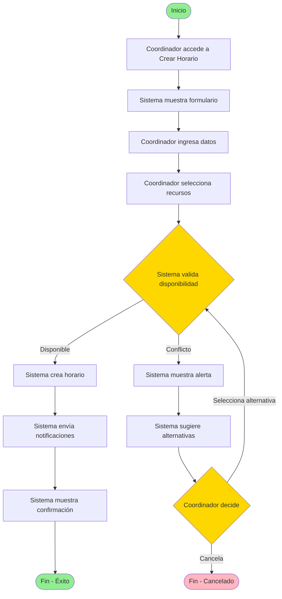

### 5.2 CU-02: Visualizar Horarios Personales
**Actor Principal**: Usuario Final  
**Precondiciones**: Usuario autenticado  
**Flujo Principal**:
1. El usuario accede al dashboard
2. El sistema muestra vista de calendario por defecto (semana)
3. El usuario puede cambiar vista (día/semana/mes)
4. El sistema presenta horarios asignados al usuario
5. El usuario puede hacer clic en un horario para ver detalles
6. El sistema muestra información completa del horario

**Postcondiciones**: Ninguna

#### Diagrama de Flujo: CU-02
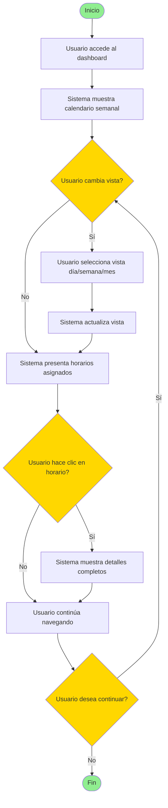

### 5.3 CU-03: Gestionar Recursos
**Actor Principal**: Administrador  
**Precondiciones**: Usuario autenticado con rol de administrador  
**Flujo Principal**:
1. El administrador accede a "Gestión de Recursos"
2. El sistema muestra lista de recursos existentes
3. El administrador selecciona "Agregar Recurso"
4. El sistema muestra formulario de alta
5. El administrador completa información del recurso
6. El sistema valida datos ingresados
7. El sistema crea el recurso
8. El sistema muestra confirmación

**Postcondiciones**: Nuevo recurso disponible en el sistema

#### Diagrama de Flujo: CU-03
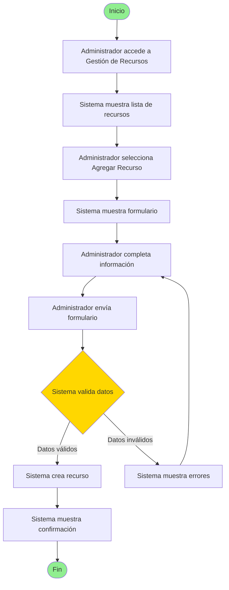

### 5.4 CU-04: Resolver Conflictos
**Actor Principal**: Coordinador  
**Precondiciones**: Conflicto detectado en horario  
**Flujo Principal**:
1. El sistema detecta conflicto y notifica al coordinador
2. El coordinador accede a la gestión de conflictos
3. El sistema muestra detalles del conflicto
4. El coordinador solicita alternativas
5. El sistema genera sugerencias de resolución
6. El coordinador selecciona una opción
7. El sistema actualiza horarios afectados
8. El sistema notifica a usuarios impactados

**Postcondiciones**: Conflicto resuelto, horarios actualizados

#### Diagrama de Flujo: CU-04
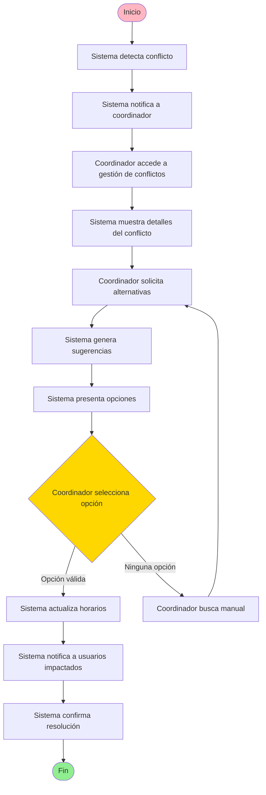

### 5.5 CU-05: Generar Reporte
**Actor Principal**: Administrador/Coordinador  
**Precondiciones**: Usuario autenticado con permisos  
**Flujo Principal**:
1. El usuario accede a "Reportes"
2. El sistema muestra opciones de reportes disponibles
3. El usuario selecciona tipo de reporte
4. El usuario define parámetros (fechas, filtros)
5. El sistema procesa la solicitud
6. El sistema genera reporte con visualizaciones
7. El usuario puede exportar reporte en formato deseado

**Postcondiciones**: Reporte generado y disponible

#### Diagrama de Flujo: CU-05
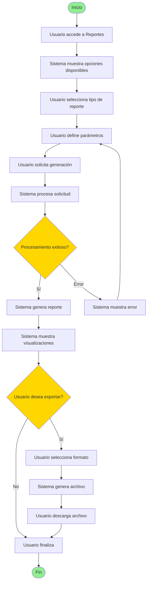

### 5.6 CU-06: Generar Horario Escolar Automáticamente
**Actor Principal**: Coordinador Académico  
**Precondiciones**: 
- Estructura del centro configurada (3 niveles, 3 clases por nivel)
- Plan de estudios definido con 8 asignaturas y sus horas
- Profesorado registrado con asignaturas autorizadas
- Jornada escolar configurada (5 períodos × 5 días)
- Suficientes profesores para cubrir 216 horas semanales totales

**Flujo Principal**:
1. El coordinador accede a "Generación de Horarios"
2. El sistema muestra resumen de configuración actual
3. El coordinador verifica profesores disponibles y carga asignada
4. El coordinador selecciona "Generar Horario Automáticamente"
5. El sistema solicita confirmación y opciones (nivel específico o todos)
6. El coordinador confirma generación completa
7. El sistema ejecuta algoritmo de generación cumpliendo restricciones duras
8. El sistema aplica optimizaciones según restricciones blandas
9. El sistema valida el horario generado
10. El sistema muestra horario propuesto con estadísticas de calidad
11. El coordinador revisa horarios por grupo y por profesor
12. El coordinador aprueba el horario
13. El sistema guarda y activa el horario
14. El sistema notifica a profesores de sus asignaciones

**Flujo Alternativo 7a**: No se puede generar horario válido
- 7a.1: El sistema identifica restricciones imposibles de cumplir
- 7a.2: El sistema muestra análisis del problema (ej: profesores insuficientes)
- 7a.3: El sistema sugiere ajustes (agregar profesores, reducir horas)
- 7a.4: El coordinador ajusta configuración
- Retorna a paso 3

**Flujo Alternativo 10a**: Coordinador solicita regeneración
- 10a.1: El coordinador no está satisfecho con la distribución
- 10a.2: El coordinador selecciona "Regenerar con diferentes criterios"
- 10a.3: El coordinador ajusta ponderación de restricciones blandas
- Retorna a paso 7

**Flujo Alternativo 11a**: Ajuste manual necesario
- 11a.1: El coordinador detecta un período específico a modificar
- 11a.2: El coordinador hace clic en el período
- 11a.3: El sistema muestra opciones de reasignación
- 11a.4: El coordinador selecciona nueva asignación
- 11a.5: El sistema valida cambio en tiempo real
- 11a.6: Si es válido, aplica cambio; si no, muestra conflicto
- Retorna a paso 11

**Postcondiciones**: 
- Horario semanal completo generado para los 9 grupos
- 24 horas semanales asignadas correctamente a cada grupo
- Profesores asignados sin exceder 20 horas semanales
- Todas las restricciones duras cumplidas
- Horario visible para todos los usuarios según permisos

#### Diagrama de Flujo: CU-06
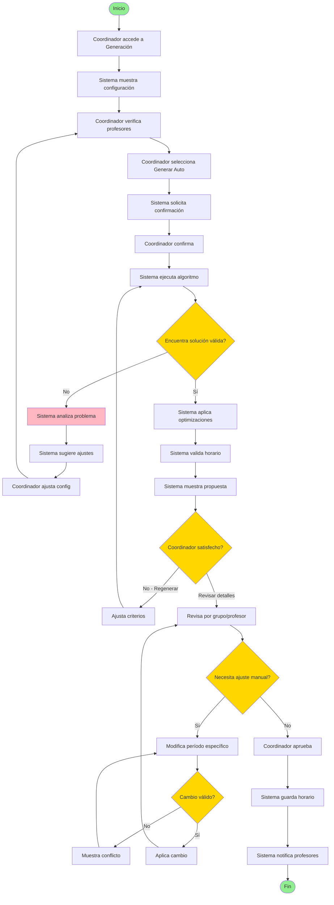

---

## 6. Interfaz de Usuario

### 6.1 Mockups y Wireframes
*(Pendiente de diseño - incluir en iteración posterior)*

### 6.2 Navegación Principal
- **Dashboard**: Vista principal con resumen
- **Horarios**: Vista de calendario (día/semana/mes)
- **Recursos**: Gestión de salas, equipos, personas
- **Reportes**: Generación de informes
- **Configuración**: Preferencias y administración
- **Perfil**: Información del usuario

### 6.3 Componentes de UI Requeridos
- Calendario interactivo (drag & drop)
- Formularios modales
- Notificaciones toast
- Tablas con paginación y ordenamiento
- Filtros avanzados
- Gráficos y visualizaciones (charts)
- Selector de fecha/hora
- Búsqueda con autocompletado

### 6.4 Responsividad
- Desktop: Interfaz completa con paneles laterales
- Tablet: Interfaz adaptada con menú colapsable
- Mobile: Vista simplificada con navegación bottom-tabs

---

## 7. Integraciones Externas

### 7.1 Exportación de Horarios
- Exportación a PDF (usando bibliotecas .NET como iTextSharp o DinkToPdf)
- Exportación a Excel (usando EPPlus o ClosedXML)
- Exportación a formato iCal para calendarios externos
- Generación de archivos CSV para análisis

### 7.2 Notificaciones (Fase 2)
- Integración con servicios de email SMTP (Gmail, SendGrid, u otros)
- Notificaciones por correo electrónico a profesores

### 7.3 Autenticación
- ASP.NET Core Identity para gestión de usuarios
- JWT (JSON Web Tokens) para autenticación stateless
- Roles y políticas de autorización integrados
- (Opcional futuro) OpenID Connect para SSO empresarial

### 7.4 API REST
- API REST documentada con Swagger/OpenAPI
- Endpoints para todas las operaciones CRUD
- Versionado de API (v1)
- Respuestas en formato JSON

---

## 8. Modelado de Datos (MSSQL Server Docker)

### 8.1 Esquema de Base de Datos

**Convenciones:**
- Primary Keys: `Id` (int identity) o `Guid` para entidades principales
- Foreign Keys: `{Tabla}Id`
- Timestamps: `CreatedAt`, `UpdatedAt`
- Soft Delete: `IsDeleted` (bit), `DeletedAt` (datetime2 nullable)

### 8.2 Entidades Principales (Code-First EF Core)

#### Tabla: Usuarios
```sql
CREATE TABLE Usuarios (
    Id INT IDENTITY(1,1) PRIMARY KEY,
    Email NVARCHAR(256) NOT NULL UNIQUE,
    PasswordHash NVARCHAR(MAX) NOT NULL,
    NombreCompleto NVARCHAR(200) NOT NULL,
    Rol NVARCHAR(50) NOT NULL CHECK (Rol IN ('Administrador', 'Coordinador', 'Profesor', 'Estudiante')),
    Activo BIT NOT NULL DEFAULT 1,
    CreatedAt DATETIME2 NOT NULL DEFAULT GETUTCDATE(),
    UpdatedAt DATETIME2 NULL
);
```

#### Tabla: Niveles
```sql
CREATE TABLE Niveles (
    Id INT IDENTITY(1,1) PRIMARY KEY,
    Nombre NVARCHAR(100) NOT NULL,
    Orden INT NOT NULL,
    Descripcion NVARCHAR(500) NULL,
    Activo BIT NOT NULL DEFAULT 1
);
```

#### Tabla: Clases
```sql
CREATE TABLE Clases (
    Id INT IDENTITY(1,1) PRIMARY KEY,
    NivelId INT NOT NULL FOREIGN KEY REFERENCES Niveles(Id),
    Nombre NVARCHAR(10) NOT NULL, -- 'A', 'B', 'C'
    NumeroAlumnos INT NOT NULL DEFAULT 25,
    Activo BIT NOT NULL DEFAULT 1,
    CONSTRAINT UQ_Nivel_Clase UNIQUE (NivelId, Nombre)
);
```

#### Tabla: Asignaturas
```sql
CREATE TABLE Asignaturas (
    Id INT IDENTITY(1,1) PRIMARY KEY,
    Nombre NVARCHAR(100) NOT NULL UNIQUE,
    HorasSemanales INT NOT NULL,
    Color NVARCHAR(7) NULL, -- Código hex para visualización
    Descripcion NVARCHAR(500) NULL,
    Activo BIT NOT NULL DEFAULT 1
);
```

#### Tabla: Profesores
```sql
CREATE TABLE Profesores (
    Id INT IDENTITY(1,1) PRIMARY KEY,
    UsuarioId INT NULL FOREIGN KEY REFERENCES Usuarios(Id),
    Codigo NVARCHAR(20) NOT NULL UNIQUE,
    NombreCompleto NVARCHAR(200) NOT NULL,
    Email NVARCHAR(256) NULL,
    MaxHorasSemanales INT NOT NULL DEFAULT 20,
    Activo BIT NOT NULL DEFAULT 1,
    CreatedAt DATETIME2 NOT NULL DEFAULT GETUTCDATE()
);
```

#### Tabla: ProfesorAsignatura (Máx. 2 asignaturas por profesor)
```sql
CREATE TABLE ProfesorAsignatura (
    Id INT IDENTITY(1,1) PRIMARY KEY,
    ProfesorId INT NOT NULL FOREIGN KEY REFERENCES Profesores(Id),
    AsignaturaId INT NOT NULL FOREIGN KEY REFERENCES Asignaturas(Id),
    Prioridad INT NOT NULL DEFAULT 1, -- 1 = Principal, 2 = Secundaria
    CONSTRAINT UQ_Profesor_Asignatura UNIQUE (ProfesorId, AsignaturaId)
);
```

#### Tabla: Aulas
```sql
CREATE TABLE Aulas (
    Id INT IDENTITY(1,1) PRIMARY KEY,
    Nombre NVARCHAR(50) NOT NULL UNIQUE,
    Capacidad INT NOT NULL,
    Tipo NVARCHAR(50) NULL, -- 'Normal', 'Laboratorio', 'Gimnasio'
    Activo BIT NOT NULL DEFAULT 1
);
```

#### Tabla: Periodos (Configuración de jornada)
```sql
CREATE TABLE Periodos (
    Id INT IDENTITY(1,1) PRIMARY KEY,
    Numero INT NOT NULL CHECK (Numero BETWEEN 1 AND 5),
    HoraInicio TIME(0) NOT NULL,
    HoraFin TIME(0) NOT NULL,
    EsDescanso BIT NOT NULL DEFAULT 0,
    CONSTRAINT UQ_Numero_Periodo UNIQUE (Numero)
);
```

#### Tabla: Horarios (Versiones de horarios generados)
```sql
CREATE TABLE Horarios (
    Id INT IDENTITY(1,1) PRIMARY KEY,
    Nombre NVARCHAR(200) NOT NULL,
    Descripcion NVARCHAR(1000) NULL,
    AnioEscolar NVARCHAR(20) NOT NULL, -- '2025-2026'
    FechaGeneracion DATETIME2 NOT NULL DEFAULT GETUTCDATE(),
    GeneradoPor INT NOT NULL FOREIGN KEY REFERENCES Usuarios(Id),
    Estado NVARCHAR(50) NOT NULL CHECK (Estado IN ('Borrador', 'Activo', 'Archivado')),
    PuntuacionCalidad DECIMAL(5,2) NULL, -- Score de optimización
    Observaciones NVARCHAR(MAX) NULL
);
```

#### Tabla: Asignaciones (Núcleo del horario)
```sql
CREATE TABLE Asignaciones (
    Id INT IDENTITY(1,1) PRIMARY KEY,
    HorarioId INT NOT NULL FOREIGN KEY REFERENCES Horarios(Id) ON DELETE CASCADE,
    ClaseId INT NOT NULL FOREIGN KEY REFERENCES Clases(Id),
    AsignaturaId INT NOT NULL FOREIGN KEY REFERENCES Asignaturas(Id),
    ProfesorId INT NOT NULL FOREIGN KEY REFERENCES Profesores(Id),
    AulaId INT NULL FOREIGN KEY REFERENCES Aulas(Id),
    DiaSemana INT NOT NULL CHECK (DiaSemana BETWEEN 1 AND 5), -- 1=Lun, 5=Vie
    PeriodoNumero INT NOT NULL CHECK (PeriodoNumero BETWEEN 1 AND 5),
    Observaciones NVARCHAR(500) NULL,
    CONSTRAINT UQ_Horario_Clase_Dia_Periodo UNIQUE (HorarioId, ClaseId, DiaSemana, PeriodoNumero),
    CONSTRAINT UQ_Horario_Profesor_Dia_Periodo UNIQUE (HorarioId, ProfesorId, DiaSemana, PeriodoNumero),
    CONSTRAINT UQ_Horario_Aula_Dia_Periodo UNIQUE (HorarioId, AulaId, DiaSemana, PeriodoNumero)
);
```

#### Tabla: BloqueosProfesor (Indisponibilidades)
```sql
CREATE TABLE BloqueosProfesor (
    Id INT IDENTITY(1,1) PRIMARY KEY,
    ProfesorId INT NOT NULL FOREIGN KEY REFERENCES Profesores(Id),
    DiaSemana INT NOT NULL CHECK (DiaSemana BETWEEN 1 AND 5),
    PeriodoNumero INT NOT NULL CHECK (PeriodoNumero BETWEEN 1 AND 5),
    Motivo NVARCHAR(200) NULL,
    Activo BIT NOT NULL DEFAULT 1,
    CONSTRAINT UQ_Bloqueo_Profesor_Dia_Periodo UNIQUE (ProfesorId, DiaSemana, PeriodoNumero)
);
```

#### Tabla: RegistroValidaciones (Log de validaciones)
```sql
CREATE TABLE RegistroValidaciones (
    Id INT IDENTITY(1,1) PRIMARY KEY,
    HorarioId INT NOT NULL FOREIGN KEY REFERENCES Horarios(Id),
    FechaValidacion DATETIME2 NOT NULL DEFAULT GETUTCDATE(),
    TipoValidacion NVARCHAR(50) NOT NULL, -- 'Dura', 'Blanda'
    Resultado BIT NOT NULL,
    RestriccionesVioladas NVARCHAR(MAX) NULL, -- JSON o texto
    DetalleJSON NVARCHAR(MAX) NULL
);
```

### 8.3 Índices Recomendados

```sql
-- Para búsquedas frecuentes
CREATE INDEX IX_Asignaciones_HorarioId ON Asignaciones(HorarioId);
CREATE INDEX IX_Asignaciones_ClaseId ON Asignaciones(ClaseId);
CREATE INDEX IX_Asignaciones_ProfesorId ON Asignaciones(ProfesorId);
CREATE INDEX IX_Asignaciones_DiaSemana_Periodo ON Asignaciones(DiaSemana, PeriodoNumero);

CREATE INDEX IX_Clases_NivelId ON Clases(NivelId);
CREATE INDEX IX_ProfesorAsignatura_ProfesorId ON ProfesorAsignatura(ProfesorId);
CREATE INDEX IX_ProfesorAsignatura_AsignaturaId ON ProfesorAsignatura(AsignaturaId);
```

### 8.4 Vistas para Consultas Comunes

#### Vista: HorarioPorClase
```sql
CREATE VIEW vw_HorarioPorClase AS
SELECT 
    a.HorarioId,
    n.Nombre AS Nivel,
    c.Nombre AS Clase,
    a.DiaSemana,
    a.PeriodoNumero,
    p.HoraInicio,
    p.HoraFin,
    asig.Nombre AS Asignatura,
    prof.NombreCompleto AS Profesor,
    au.Nombre AS Aula
FROM Asignaciones a
INNER JOIN Clases c ON a.ClaseId = c.Id
INNER JOIN Niveles n ON c.NivelId = n.Id
INNER JOIN Asignaturas asig ON a.AsignaturaId = asig.Id
INNER JOIN Profesores prof ON a.ProfesorId = prof.Id
INNER JOIN Periodos p ON a.PeriodoNumero = p.Numero
LEFT JOIN Aulas au ON a.AulaId = au.Id;
```

### 8.5 Stored Procedures Clave

#### SP: Validar disponibilidad de profesor
```sql
CREATE PROCEDURE sp_ValidarDisponibilidadProfesor
    @HorarioId INT,
    @ProfesorId INT,
    @DiaSemana INT,
    @PeriodoNumero INT
AS
BEGIN
    -- Verifica si el profesor ya tiene asignación en ese período
    -- Verifica si hay bloqueo activo
    -- Retorna 1 si está disponible, 0 si no
END;
```

### 8.6 Configuración Entity Framework Core

**DbContext:**
```csharp
public class HorariosDbContext : DbContext
{
    public DbSet<Usuario> Usuarios { get; set; }
    public DbSet<Nivel> Niveles { get; set; }
    public DbSet<Clase> Clases { get; set; }
    public DbSet<Asignatura> Asignaturas { get; set; }
    public DbSet<Profesor> Profesores { get; set; }
    public DbSet<Aula> Aulas { get; set; }
    public DbSet<Periodo> Periodos { get; set; }
    public DbSet<Horario> Horarios { get; set; }
    public DbSet<Asignacion> Asignaciones { get; set; }
    public DbSet<BloqueoProfesor> BloqueosProfesor { get; set; }
    
    protected override void OnModelCreating(ModelBuilder modelBuilder)
    {
        // Configuraciones de entidades, relaciones, índices
        modelBuilder.ApplyConfigurationsFromAssembly(typeof(HorariosDbContext).Assembly);
    }
}
```

### 8.7 Estrategia de Testing con Mock

**In-Memory Database para Tests:**
```csharp
var options = new DbContextOptionsBuilder<HorariosDbContext>()
    .UseInMemoryDatabase(databaseName: "HorariosTestDb")
    .Options;

using var context = new HorariosDbContext(options);
// Seed data para tests
// Ejecutar pruebas
```

**Repositorio Mock con Moq:**
```csharp
var mockRepo = new Mock<IProfesorRepository>();
mockRepo.Setup(r => r.GetByIdAsync(It.IsAny<int>()))
        .ReturnsAsync(new Profesor { Id = 1, NombreCompleto = "Test" });
```

---

## 9. Restricciones y Supuestos

### 9.1 Restricciones Técnicas
- Desarrollo en stack tecnológico .NET 8 + HTML/CSS/Bootstrap
- Base de datos MSSQL Server en contenedor Docker
- Despliegue con Docker y Docker Compose
- CI/CD implementado desde inicio con GitHub Actions

### 9.2 Restricciones de Negocio
- Presupuesto limitado para fase 1
- Lanzamiento objetivo: [Fecha a definir]
- Equipo de desarrollo: [Tamaño a definir]

### 9.3 Supuestos
- Usuarios tienen conocimientos básicos de informática
- Conexión a internet disponible
- Dispositivos con navegadores actualizados
- Infraestructura cloud disponible

---

## 10. Planificación y Fases

### Fase 1: MVP (Producto Mínimo Viable)
- Autenticación básica
- CRUD de horarios
- Vista de calendario
- Gestión básica de recursos
- Detección de conflictos

### Fase 2: Caracteristicas Avanzadas
- Notificaciones por email
- Reportes básicos
- Integración con calendarios externos
- Aplicación móvil responsive

### Fase 3: Optimización y Escalado
- Dashboard analítico
- Notificaciones push
- API pública
- Optimizaciones de rendimiento

---

## 11. Riesgos Identificados

| Riesgo | Probabilidad | Impacto | Mitigación |
|--------|--------------|---------|------------|
| Conflictos de horario no detectados | Media | Alto | Testing exhaustivo de validaciones |
| Bajo rendimiento con muchos usuarios | Media | Alto | Arquitectura escalable, caching |
| Problemas de sincronización externa | Alta | Medio | Manejo robusto de errores, logs |
| Resistencia al cambio de usuarios | Media | Medio | UX intuitiva, capacitación |
| Vulnerabilidades de seguridad | Baja | Alto | Auditorías de seguridad, buenas prácticas |

---

## 12. Criterios de Aceptación

### 12.1 Funcionales
- [ ] Todos los requisitos funcionales implementados según especificación
- [ ] Casos de uso ejecutables sin errores
- [ ] Validaciones de datos funcionando correctamente
- [ ] Notificaciones enviadas según configuración

### 12.2 No Funcionales
- [ ] Tiempo de carga < 2 segundos
- [ ] Disponibilidad > 99.5%
- [ ] Cobertura de tests > 80%
- [ ] Sin vulnerabilidades críticas en análisis de seguridad

### 12.3 Usabilidad
- [ ] Interfaz aprobada por usuarios piloto
- [ ] Documentación de usuario completa
- [ ] Cumplimiento de estándares de accesibilidad

---

## 13. Aprobaciones

| Rol | Nombre | Firma | Fecha |
|-----|--------|-------|-------|
| Product Owner | [Por definir] | | |
| Líder Técnico | [Por definir] | | |
| Stakeholder | [Por definir] | | |

---

## 14. Control de Versiones

| Versión | Fecha | Autor | Cambios |
|---------|-------|-------|---------|
| 1.0 | 2026-02-11 | [Autor] | Versión inicial |

---

## 15. Anexos

### Anexo A: Glosario Técnico
*(Pendiente)*

### Anexo B: Diagramas de Arquitectura

#### B.1 Diagrama de Arquitectura General del Sistema

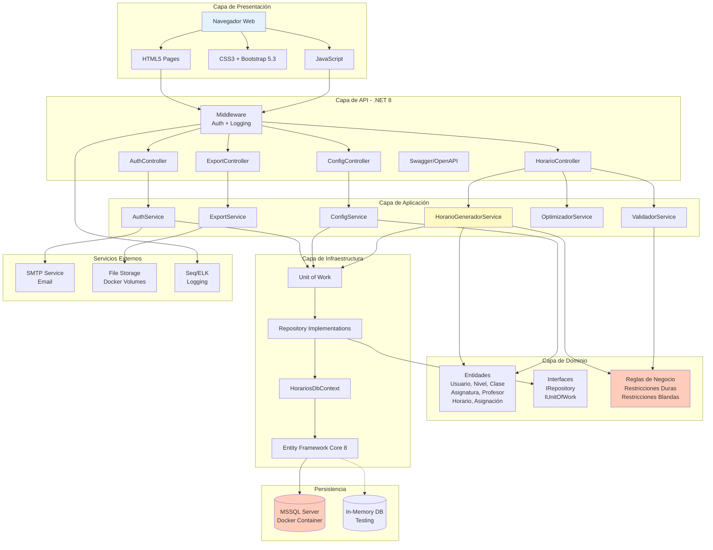

#### B.2 Diagrama de Componentes - Módulo de Generación de Horarios

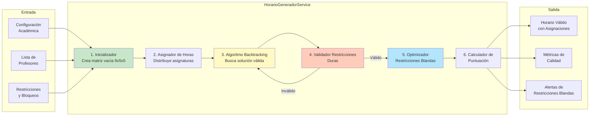

#### B.3 Diagrama de Secuencia - Generar Horario Automáticamente

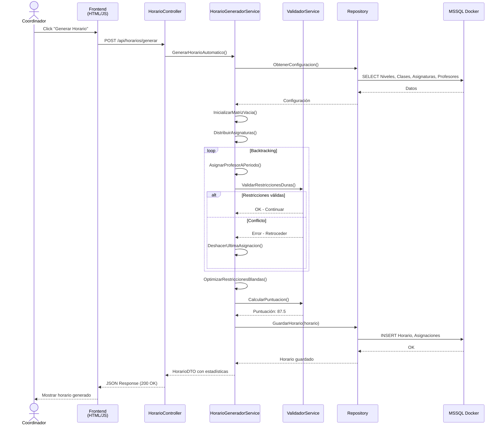

#### B.4 Diagrama de Clases - Modelo de Dominio

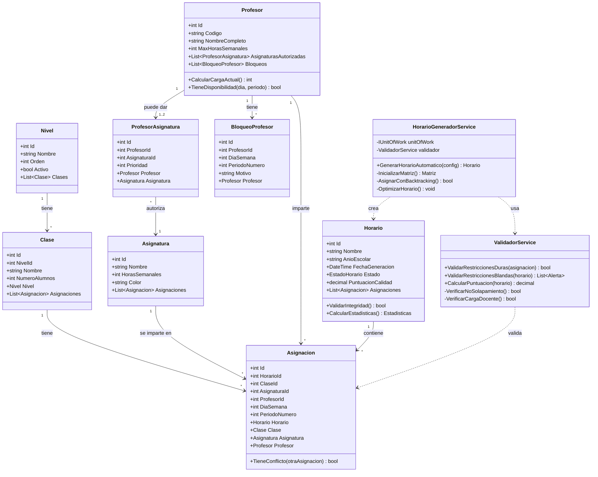

#### B.5 Diagrama de Flujo de Datos - Visualización de Horarios

```mermaid
graph LR
    subgraph "Usuario"
        User[Coordinador/<br/>Profesor]
    end
    
    subgraph "Frontend"
        Select[Selector de Vista<br/>Grupo/Profesor/Aula]
        Filtros[Filtros<br/>Nivel, Clase, Fecha]
        Tabla[Tabla Bootstrap<br/>5x5 Grid]
        Export[Botón Exportar]
    end
    
    subgraph "API REST"
        GetGrupo[GET /api/horarios/grupo/{id}]
        GetProfesor[GET /api/horarios/profesor/{id}]
        GetExport[GET /api/horarios/export/pdf]
    end
    
    subgraph "Services"
        QuerySvc[HorarioQueryService]
        ExportSvc[ExportService]
    end
    
    subgraph "Database"
        View[vw_HorarioPorClase]
        Tables[Tablas SQL]
    end
    
    subgraph "Archivos"
        PDF[PDF File]
        Excel[Excel File]
    end
    
    User --> Select
    User --> Filtros
    Select --> GetGrupo
    Select --> GetProfesor
    Filtros --> GetGrupo
    
    GetGrupo --> QuerySvc
    GetProfesor --> QuerySvc
    QuerySvc --> View
    QuerySvc --> Tables
    
    View --> QuerySvc
    Tables --> QuerySvc
    QuerySvc --> Tabla
    
    Tabla --> User
    
    User --> Export
    Export --> GetExport
    GetExport --> ExportSvc
    ExportSvc --> PDF
    ExportSvc --> Excel
    
    PDF --> User
    Excel --> User
```

#### B.6 Diagrama de Despliegue - Docker

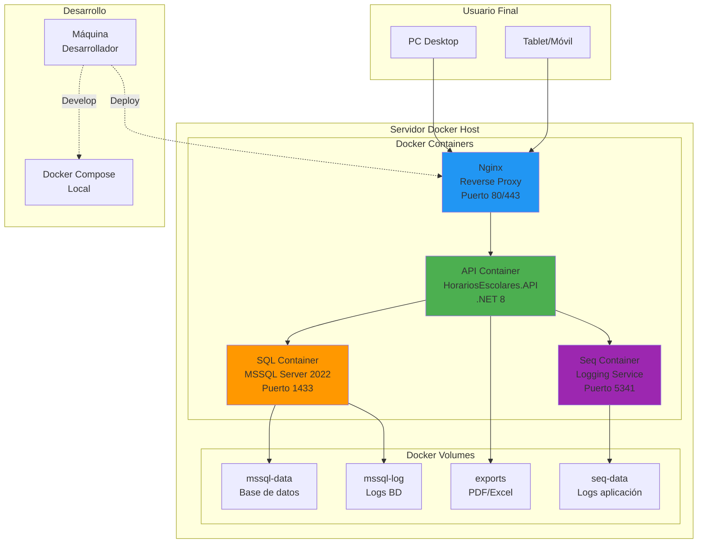

---

### Anexo C: Prototipos de UI

#### C.1 Página de Inicio / Dashboard

**Wireframe ASCII:**
```
┌────────────────────────────────────────────────────────────────────┐
│  SISTEMA DE GESTIÓN DE HORARIOS ESCOLARES        👤 Coordinador ▼ │
├────────────────────────────────────────────────────────────────────┤
│  [Dashboard] [Configuración] [Generar] [Horarios] [Reportes]      │
├────────────────────────────────────────────────────────────────────┤
│                                                                     │
│  📊 Resumen General                                                │
│  ┌─────────────────┐ ┌─────────────────┐ ┌─────────────────┐     │
│  │   NIVELES       │ │    PROFESORES   │ │   ASIGNATURAS   │     │
│  │                 │ │                 │ │                 │     │
│  │       3         │ │       11        │ │       8         │     │
│  │                 │ │                 │ │                 │     │
│  └─────────────────┘ └─────────────────┘ └─────────────────┘     │
│                                                                     │
│  ┌─────────────────┐ ┌─────────────────┐ ┌─────────────────┐     │
│  │    CLASES       │ │  HORAS TOTALES  │ │  HORARIO ACTIVO │     │
│  │                 │ │                 │ │                 │     │
│  │       9         │ │      216        │ │  ✓ 2025-2026    │     │
│  │                 │ │                 │ │                 │     │
│  └─────────────────┘ └─────────────────┘ └─────────────────┘     │
│                                                                     │
│  📅 Horario Activo: Curso 2025-2026                               │
│  ┌──────────────────────────────────────────────────────────────┐ │
│  │ Nombre: Horario Principal                                    │ │
│  │ Generado: 15/01/2026                                         │ │
│  │ Estado: ✓ Activo                                             │ │
│  │ Calidad: ⭐⭐⭐⭐☆ (87.5/100)                                  │ │
│  │                                                               │ │
│  │ [Ver Horarios] [Generar Nuevo] [Exportar]                   │ │
│  └──────────────────────────────────────────────────────────────┘ │
│                                                                     │
│  🔔 Notificaciones Recientes                                       │
│  • Horario generado exitosamente (hace 2 días)                    │
│  • Prof. García solicitó cambio en Nivel 2A (hace 1 semana)       │
│                                                                     │
└────────────────────────────────────────────────────────────────────┘
```

**Componentes Bootstrap:**
- Navbar con menú de navegación
- Cards (tarjetas) con estadísticas usando `card` y `card-body`
- Badge para estado activo
- Rating con estrellas
- Lista de notificaciones con badges de tiempo
- Botones primarios y secundarios

---

#### C.2 Configuración Académica - Gestión de Profesores

**Wireframe ASCII:**
```
┌────────────────────────────────────────────────────────────────────┐
│  CONFIGURACIÓN ACADÉMICA                          👤 Coordinador ▼ │
├────────────────────────────────────────────────────────────────────┤
│  [Niveles] [Clases] [Asignaturas] [👥 Profesores] [Aulas] [Jor.] │
├────────────────────────────────────────────────────────────────────┤
│                                                                     │
│  👥 Gestión de Profesores                                          │
│  ┌──────────────────────────────────────────────────────────────┐ │
│  │ 🔍 Buscar: [_____________]  [+ Nuevo Profesor]              │ │
│  └──────────────────────────────────────────────────────────────┘ │
│                                                                     │
│  ┌──────────────────────────────────────────────────────────────┐ │
│  │ Código │ Nombre           │ Asignaturas      │ Horas │ ⚙️   │ │
│  ├────────┼──────────────────┼──────────────────┼───────┼─────┤ │
│  │ P001   │ García Pérez, A. │ Matemáticas      │ 16/20 │ ✏️🗑️│ │
│  │        │                  │ F. y Química     │       │     │ │
│  ├────────┼──────────────────┼──────────────────┼───────┼─────┤ │
│  │ P002   │ Martínez López,M │ Inglés           │ 9/20  │ ✏️🗑️│ │
│  │        │                  │ Ética            │       │     │ │
│  ├────────┼──────────────────┼──────────────────┼───────┼─────┤ │
│  │ P003   │ Rodríguez Silva  │ Historia         │ 12/20 │ ✏️🗑️│ │
│  │        │                  │                  │       │     │ │
│  ├────────┼──────────────────┼──────────────────┼───────┼─────┤ │
│  │ P004   │ Fernández Torres │ Lengua Española  │ 12/20 │ ✏️🗑️│ │
│  │        │                  │                  │       │     │ │
│  ├────────┼──────────────────┼──────────────────┼───────┼─────┤ │
│  │ ...    │ ...              │ ...              │ ...   │ ... │ │
│  └────────┴──────────────────┴──────────────────┴───────┴─────┘ │
│                                                                     │
│  Mostrando 11 profesores                      [ 1 ] 2 3  ▶        │
│                                                                     │
└────────────────────────────────────────────────────────────────────┘

┌─ MODAL: Agregar/Editar Profesor ──────────────────────────────────┐
│  ╳                                                                  │
│  Código:        [P012_____________]                                │
│                                                                     │
│  Nombre:        [_____________________________]                    │
│                                                                     │
│  Email:         [_____________________________]                    │
│                                                                     │
│  Asignaturas Autorizadas (máx. 2):                                │
│  ☑ Matemáticas     ☐ Historia        ☐ Manualidades              │
│  ☐ Inglés          ☐ F. y Química    ☐ Educación Física          │
│  ☐ Lengua Española ☐ Ética                                        │
│                                                                     │
│  Horas Semanales Máximas: [20___] (por defecto: 20)              │
│                                                                     │
│  🚫 Bloqueos de Horario (opcional):                                │
│  Lunes Período 1 ☐  Martes Período 1 ☐  ...                       │
│                                                                     │
│                           [Cancelar]  [💾 Guardar]                 │
└────────────────────────────────────────────────────────────────────┘
```

**Componentes Bootstrap:**
- Tabs de navegación (`nav-tabs`)
- Input de búsqueda con icono
- Tabla responsive (`table table-striped table-hover`)
- Badges para mostrar carga horaria (verde: <80%, amarillo: 80-100%)
- Modal para formulario de edición
- Checkboxes para selección múltiple
- Botones de acción (Editar, Eliminar)
- Paginación (`pagination`)

---

#### C.3 Generación de Horarios

**Wireframe ASCII:**
```
┌────────────────────────────────────────────────────────────────────┐
│  GENERAR HORARIO ESCOLAR                          👤 Coordinador ▼ │
├────────────────────────────────────────────────────────────────────┤
│  [Dashboard] [Configuración] [⚡ Generar] [Horarios] [Reportes]   │
├────────────────────────────────────────────────────────────────────┤
│                                                                     │
│  ⚡ Generación Automática de Horarios                              │
│                                                                     │
│  PASO 1: Configuración                                             │
│  ┌──────────────────────────────────────────────────────────────┐ │
│  │ Nombre del Horario:                                          │ │
│  │ [Horario Curso 2025-2026_________________________]          │ │
│  │                                                               │ │
│  │ Año Escolar: [2025-2026_____________]                        │ │
│  │                                                               │ │
│  │ Ámbito de Generación:                                        │ │
│  │ ⦿ Todos los niveles (recomendado)                           │ │
│  │ ○ Solo un nivel: [Seleccionar nivel ▼]                      │ │
│  └──────────────────────────────────────────────────────────────┘ │
│                                                                     │
│  PASO 2: Opciones de Optimización                                 │
│  ┌──────────────────────────────────────────────────────────────┐ │
│  │ Prioridad de Restricciones Blandas:                          │ │
│  │                                                               │ │
│  │ Distribución equilibrada:     [▓▓▓▓▓▓▓▓░░] Alta             │ │
│  │ Minimizar huecos profesores:  [▓▓▓▓▓▓░░░░] Media            │ │
│  │ Materias pesadas temprano:    [▓▓▓▓▓▓▓▓░░] Alta             │ │
│  │ Variedad diaria:              [▓▓▓▓▓░░░░░] Media-Baja       │ │
│  │                                                               │ │
│  │ ☑ Respetar bloqueos de profesores                           │ │
│  │ ☑ Evitar repetición asignatura mismo día                    │ │
│  └──────────────────────────────────────────────────────────────┘ │
│                                                                     │
│  PASO 3: Verificación Previa                                      │
│  ┌──────────────────────────────────────────────────────────────┐ │
│  │ ☑ Configuración verificada                                   │ │
│  │   • 3 niveles, 9 clases configuradas                        │ │
│  │   • 8 asignaturas, 216 horas totales                        │ │
│  │   • 11 profesores disponibles                               │ │
│  │   • Capacidad suficiente para generar horario               │ │
│  │                                                               │ │
│  │ ⚠️ Advertencias:                                              │ │
│  │   • 2 profesores tienen bloqueos activos                    │ │
│  └──────────────────────────────────────────────────────────────┘ │
│                                                                     │
│  [⬅️ Cancelar]                    [⚡ Generar Horario Automático] │
│                                                                     │
└────────────────────────────────────────────────────────────────────┘

┌─ GENERANDO HORARIO... ────────────────────────────────────────────┐
│                                                                     │
│  ⚙️ Generando horario escolar...                                   │
│                                                                     │
│  Progreso: [▓▓▓▓▓▓▓▓▓▓▓▓▓▓▓▓░░░░] 78%                            │
│                                                                     │
│  Estado actual:                                                    │
│  ✓ Matriz inicializada                                            │
│  ✓ Asignaturas distribuidas                                       │
│  ⚙️ Ejecutando backtracking... (Intento 3 de 5)                   │
│  ⏳ Asignando Nivel 2 - Clase C - Matemáticas                     │
│                                                                     │
│  Tiempo transcurrido: 18 segundos                                 │
│  Estimado restante: ~5 segundos                                   │
│                                                                     │
│                                     [❌ Cancelar Generación]       │
└────────────────────────────────────────────────────────────────────┘
```

**Componentes Bootstrap:**
- Formularios con `form-control`
- Radio buttons para opciones
- Sliders (range inputs) para ponderación
- Checkboxes para opciones
- Lista de verificación con iconos
- Alertas (`alert alert-warning`) para advertencias
- Progress bar animada
- Spinner durante generación
- Botones primary de acción

---

#### C.4 Visualización de Horarios - Por Grupo/Clase

**Wireframe ASCII:**
```
┌────────────────────────────────────────────────────────────────────┐
│  VER HORARIOS                                     👤 Coordinador ▼ │
├────────────────────────────────────────────────────────────────────┤
│  [Dashboard] [Configuración] [Generar] [📅 Horarios] [Reportes]   │
├────────────────────────────────────────────────────────────────────┤
│                                                                     │
│  📅 Visualización de Horarios - Curso 2025-2026                   │
│                                                                     │
│  [📚 Por Grupo] [👨‍🏫 Por Profesor] [🏫 Por Aula] [📊 Consolidado] │
│                                                                     │
│  Nivel: [Nivel 1 ▼]  Clase: [Clase A ▼]        [📥 Exportar PDF] │
│                                                                     │
│  ┌──────────────────────────────────────────────────────────────┐ │
│  │ HORARIO: Nivel 1 - Clase A (25 alumnos)                     │ │
│  ├────────┬───────────┬───────────┬───────────┬───────────┬────┤ │
│  │ Hora   │   Lunes   │  Martes   │ Miércoles │  Jueves   │Vier│ │
│  ├────────┼───────────┼───────────┼───────────┼───────────┼────┤ │
│  │08:00   │📐 MATEMÁ  │📖 LENGUA  │📐 MATEMÁ  │🌍 HISTORIA│📐M │ │
│  │08:55   │  TICAS    │  ESPAÑOLA │  TICAS    │           │ATÉ │ │
│  │        │Prof.García│Prof.Fdez  │Prof.García│Prof.Rodríg│Ma. │ │
│  │        │Aula: 101  │Aula: 101  │Aula: 101  │Aula: 101  │101 │ │
│  ├────────┼───────────┼───────────┼───────────┼───────────┼────┤ │
│  │09:00   │🌍 HISTORIA│🌍 HISTORIA│🔬 FÍSICA  │📐 MATEMÁ  │🌐I │ │
│  │09:55   │           │           │  QUÍMICA  │  TICAS    │NG  │ │
│  │        │Prof.Rodríg│Prof.Rodríg│Prof.García│Prof.García│Mar │ │
│  │        │Aula: 101  │Aula: 101  │Lab: 201   │Aula: 101  │101 │ │
│  ├────────┴───────────┴───────────┴───────────┴───────────┴────┤ │
│  │                   ☕ DESCANSO (20 minutos)                     │ │
│  ├────────┬───────────┬───────────┬───────────┬───────────┬────┤ │
│  │10:15   │🌐 INGLÉS  │📐 MATEMÁ  │🌐 INGLÉS  │📖 LENGUA  │🔬F│ │
│  │11:10   │           │  TICAS    │           │  ESPAÑOLA │ÍS. │ │
│  │        │Prof.Martín│Prof.García│Prof.Martín│Prof.Fdez  │Gar │ │
│  │        │Aula: 101  │Aula: 101  │Aula: 101  │Aula: 101  │201 │ │
│  ├────────┼───────────┼───────────┼───────────┼───────────┼────┤ │
│  │11:15   │📖 LENGUA  │🔬 FÍSICA  │🎨 MANUAL  │🔬 FÍSICA  │📖L│ │
│  │12:10   │  ESPAÑOLA │  QUÍMICA  │  IDADES   │  QUÍMICA  │ENG │ │
│  │        │Prof.Fdez  │Prof.García│Prof.Torres│Prof.García│Fde │ │
│  │        │Aula: 101  │Lab: 201   │Taller: 105│Lab: 201   │101 │ │
│  ├────────┼───────────┼───────────┼───────────┼───────────┼────┤ │
│  │12:15   │✅ ÉTICA   │🌐 INGLÉS  │📖 LENGUA  │⚽ EDUC.   │🎨M│ │
│  │13:10   │           │           │  ESPAÑOLA │  FÍSICA   │AN  │ │
│  │        │Prof.Martín│Prof.Martín│Prof.Fdez  │Prof.López │Tor │ │
│  │        │Aula: 101  │Aula: 101  │Aula: 101  │Gimnas: G1 │105 │ │
│  └────────┴───────────┴───────────┴───────────┴───────────┴────┘ │
│                                                                     │
│  📊 Estadísticas:                                                  │
│  • Total horas semanales: 24  • Materias: 8  • Profesores: 6      │
│  • Calidad de distribución: ⭐⭐⭐⭐☆ (88%)                        │
│                                                                     │
│  [⬅️ Anterior Clase]  [Editar Manualmente]  [Siguiente Clase ➡️] │
│                                                                     │
└────────────────────────────────────────────────────────────────────┘
```

**Componentes Bootstrap:**
- Tabs para diferentes vistas (`nav-tabs`)
- Selectores (dropdowns) para filtros
- Tabla con bordes (`table table-bordered`)
- Celdas con colores por asignatura (usando clases de Bootstrap o custom)
- Iconos para cada asignatura
- Fila destacada para el descanso (`table-warning`)
- Cards para estadísticas
- Botones de navegación y exportación
- Tooltip al hacer hover sobre celdas (con JavaScript)

---

#### C.5 Visualización de Horarios - Por Profesor

**Wireframe ASCII:**
```
┌────────────────────────────────────────────────────────────────────┐
│  VER HORARIOS - POR PROFESOR                      👤 Prof. García ▼│
├────────────────────────────────────────────────────────────────────┤
│  [📅 Mi Horario] [Ver Otros Profesores]                           │
│                                                                     │
│  👨‍🏫 Horario del Profesor: García Pérez, Antonio                  │
│                                                                     │
│  📊 Carga Horaria: 16 / 20 horas (80%)  [▓▓▓▓▓▓▓▓░░]             │
│  📚 Asignaturas: Matemáticas, Física y Química                    │
│                                                                     │
│  ┌──────────────────────────────────────────────────────────────┐ │
│  ├────────┬───────────┬───────────┬───────────┬───────────┬────┤ │
│  │ Hora   │   Lunes   │  Martes   │ Miércoles │  Jueves   │Vier│ │
│  ├────────┼───────────┼───────────┼───────────┼───────────┼────┤ │
│  │08:00   │📐 MAT     │ [Libre]   │📐 MAT     │ [Libre]   │📐M│ │
│  │08:55   │N1-A       │           │N1-A       │           │N1- │ │
│  │        │Aula: 101  │           │Aula: 101  │           │101 │ │
│  ├────────┼───────────┼───────────┼───────────┼───────────┼────┤ │
│  │09:00   │🔬 F.QUÍM  │🔬 F.QUÍM  │🔬 F.QUÍM  │📐 MAT     │[Li│ │
│  │09:55   │N2-B       │N1-A       │N3-C       │N1-A       │bre │ │
│  │        │Lab: 201   │Lab: 201   │Lab: 203   │Aula: 101  │    │ │
│  ├────────┴───────────┴───────────┴───────────┴───────────┴────┤ │
│  │                   ☕ DESCANSO (20 minutos)                     │ │
│  ├────────┬───────────┬───────────┬───────────┬───────────┬────┤ │
│  │10:15   │[Libre]    │📐 MAT     │ [Libre]   │📐 MAT     │🔬F│ │
│  │11:10   │           │N2-C       │           │N2-A       │.QU │ │
│  │        │           │Aula: 102  │           │Aula: 102  │N1- │ │
│  │        │           │           │           │           │201 │ │
│  ├────────┼───────────┼───────────┼───────────┼───────────┼────┤ │
│  │11:15   │📐 MAT     │🔬 F.QUÍM  │📐 MAT     │🔬 F.QUÍM  │ [L│ │
│  │12:10   │N3-A       │N1-A       │N2-B       │N1-A       │ibr │ │
│  │        │Aula: 103  │Lab: 201   │Aula: 102  │Lab: 201   │e]  │ │
│  ├────────┼───────────┼───────────┼───────────┼───────────┼────┤ │
│  │12:15   │🔬 F.QUÍM  │[Libre]    │📐 MAT     │📐 MAT     │📐M│ │
│  │13:10   │N2-A       │           │N3-B       │N3-C       │AT  │ │
│  │        │Lab: 201   │           │Aula: 103  │Aula: 103  │N2- │ │
│  │        │           │           │           │           │102 │ │
│  └────────┴───────────┴───────────┴───────────┴───────────┴────┘ │
│                                                                     │
│  📊 Resumen Semanal:                                               │
│  • Matemáticas: 10 períodos (Niveles 1, 2, 3)                    │
│  • Física y Química: 6 períodos (Niveles 1, 2, 3)                │
│  • Períodos libres: 9                                             │
│  • Aulas usadas: 101, 102, 103, Lab 201, Lab 203                 │
│                                                                     │
│  ⚠️ Notas:                                                         │
│  • Lunes y Miércoles: 3 períodos consecutivos con Matemáticas    │
│  • Sugerencia: Balancear carga en martes                          │
│                                                                     │
│  [📥 Exportar Mi Horario]  [📧 Enviar por Email]  [🖨️ Imprimir]  │
│                                                                     │
└────────────────────────────────────────────────────────────────────┘
```

**Componentes Bootstrap:**
- Barra de progreso (`progress`) para carga horaria
- Tabla con celdas coloreadas por asignatura
- Celdas vacías destacadas con `table-secondary`
- Badges para identificar nivel y clase
- Lista de resumen con puntos
- Alertas (`alert alert-info`) para notas y sugerencias
- Botones de acción múltiples

---

#### C.6 Exportación de Horarios - Previsualización

**Wireframe ASCII:**
```
┌────────────────────────────────────────────────────────────────────┐
│  EXPORTAR HORARIOS                                👤 Coordinador ▼ │
├────────────────────────────────────────────────────────────────────┤
│                                                                     │
│  📥 Exportar Horarios a Archivo                                    │
│                                                                     │
│  PASO 1: Seleccionar Contenido                                     │
│  ┌──────────────────────────────────────────────────────────────┐ │
│  │ Tipo de Horario:                                             │ │
│  │ ⦿ Por Grupo/Clase                                            │ │
│  │ ○ Por Profesor                                               │ │
│  │ ○ Por Aula                                                   │ │
│  │ ○ Consolidado General                                        │ │
│  │                                                               │ │
│  │ Seleccionar elementos:                                        │ │
│  │ ☑ Todos   o   Específicos: [Seleccionar... ▼]               │ │
│  │                                                               │ │
│  │ ☑ Incluir estadísticas y resumen                            │ │
│  │ ☐ Incluir notas y observaciones                             │ │
│  └──────────────────────────────────────────────────────────────┘ │
│                                                                     │
│  PASO 2: Formato de Salida                                        │
│  ┌──────────────────────────────────────────────────────────────┐ │
│  │ [📄 PDF]  [📊 Excel]  [📅 iCal]  [📋 CSV]                   │ │
│  │                                                               │ │
│  │ Formato seleccionado: PDF                                    │ │
│  │                                                               │ │
│  │ Opciones de PDF:                                             │ │
│  │ Orientación: ⦿ Horizontal  ○ Vertical                       │ │
│  │ Tamaño: [A4 ▼]                                              │ │
│  │ ☑ Incluir portada                                           │ │
│  │ ☑ Incluir membrete del centro                               │ │
│  └──────────────────────────────────────────────────────────────┘ │
│                                                                     │
│  PREVISUALIZACIÓN:                                                 │
│  ┌──────────────────────────────────────────────────────────────┐ │
│  │  ┌────────────────────────────────────────────────────┐     │ │
│  │  │ 📄                                                  │     │ │
│  │  │  CENTRO ESCOLAR XYZ                               │     │ │
│  │  │  Horario Curso 2025-2026                          │     │ │
│  │  │                                                     │     │ │
│  │  │  NIVEL 1 - CLASE A                                │     │ │
│  │  │  ┌─────┬──────┬──────┬──────┬──────┬──────┐      │     │ │
│  │  │  │Hora │ Lun  │ Mar  │ Mié  │ Jue  │ Vie  │      │     │ │
│  │  │  ├─────┼──────┼──────┼──────┼──────┼──────┤      │     │ │
│  │  │  │08:00│ MAT  │ LENG │ MAT  │ HIST │ MAT  │      │     │ │
│  │  │  │     │García│Fdez  │García│Rodrí │García│      │     │ │
│  │  │  └─────┴──────┴──────┴──────┴──────┴──────┘      │     │ │
│  │  │                                                     │     │ │
│  │  │  ... (más filas)                                  │     │ │
│  │  │                                                     │     │ │
│  │  │  Página 1 de 9                                    │     │ │
│  │  └────────────────────────────────────────────────────┘     │ │
│  │                                                               │ │
│  │  [◀️ Anterior]  Página 1/9  [Siguiente ▶️]                  │ │
│  └──────────────────────────────────────────────────────────────┘ │
│                                                                     │
│  [⬅️ Volver]                              [📥 Descargar Archivo]  │
│                                                                     │
└────────────────────────────────────────────────────────────────────┘
```

**Componentes Bootstrap:**
- Radio buttons y checkboxes para opciones
- Tabs para formato de salida
- Área de previsualización con borde
- Controles de paginación
- Botones de descarga destacados
- Cards para agrupar opciones

---

#### C.7 Edición Manual de Horario

**Wireframe ASCII:**
```
┌────────────────────────────────────────────────────────────────────┐
│  EDITAR HORARIO MANUALMENTE                       👤 Coordinador ▼ │
├────────────────────────────────────────────────────────────────────┤
│                                                                     │
│  ✏️ Modo Edición - Nivel 1 Clase A                                │
│  [Nivel: Nivel 1 ▼] [Clase: Clase A ▼]        [💾 Guardar Cambios]│
│                                                                     │
│  ⚠️ Los cambios se validan en tiempo real                          │
│                                                                     │
│  ┌──────────────────────────────────────────────────────────────┐ │
│  ├────────┬───────────┬───────────┬───────────┬───────────┬────┤ │
│  │ Hora   │   Lunes   │  Martes   │ Miércoles │  Jueves   │Vier│ │
│  ├────────┼───────────┼───────────┼───────────┼───────────┼────┤ │
│  │08:00   │[📐 MAT   ]│[📖 LENG  ]│[📐 MAT   ]│[🌍 HIST  ]│[✏️]│ │
│  │08:55   │ García    │ Fernández │ García    │ Rodríguez │    │ │
│  │        │ 🗑️ 🔄      │ 🗑️ 🔄      │ 🗑️ 🔄      │ 🗑️ 🔄      │    │ │
│  ├────────┼───────────┼───────────┼───────────┼───────────┼────┤ │
│  │09:00   │[🌍 HIST  ]│[🌍 HIST  ]│[🔬 F.Q   ]│[📐 MAT   ]│[✏️]│ │
│  │09:55   │ Rodríguez │ Rodríguez │ García    │ García    │    │ │
│  │        │ 🗑️ 🔄      │ 🗑️ 🔄      │ 🗑️ 🔄      │ 🗑️ 🔄      │    │ │
│  └────────┴───────────┴───────────┴───────────┴───────────┴────┘ │
│                                                                     │
│  [ Click en ✏️ para editar | 🗑️ para eliminar | 🔄 para cambiar ] │
│                                                                     │
└────────────────────────────────────────────────────────────────────┘

┌─ EDITAR PERÍODO ──────────────────────────────────────────────────┐
│  ╳                                                                  │
│  Editando: Lunes, Período 1 (08:00-08:55)                         │
│  Grupo: Nivel 1 - Clase A                                         │
│                                                                     │
│  Asignatura:    [Matemáticas ▼]                                   │
│                                                                     │
│  Profesor:      [García Pérez, A. ▼] ✅ Disponible                │
│                 (16/20 horas asignadas)                            │
│                                                                     │
│  Aula:          [Aula 101 ▼] ✅ Disponible                         │
│                                                                     │
│  ────────────────────────────────────────────────────────────────│ │
│  Validación en tiempo real:                                        │
│  ✅ No hay conflicto con otros grupos                              │
│  ✅ Profesor disponible en este período                            │
│  ✅ Aula disponible                                                │
│  ✅ Cumple restricciones duras                                     │
│                                                                     │
│  ⚠️ Advertencias (restricciones blandas):                          │
│  • Profesor García ya tiene 2 períodos consecutivos este día      │
│                                                                     │
│  ℹ️ Impacto:                                                       │
│  • Carga horaria Prof. García: 16 → 17 horas                      │
│  • Horas Matemáticas N1-A: 3/4 completadas                        │
│                                                                     │
│                           [Cancelar]  [✅ Aplicar Cambio]          │
└────────────────────────────────────────────────────────────────────┘

┌─ ALERTA DE CONFLICTO ─────────────────────────────────────────────┐
│  ⚠️                                                                 │
│  No se puede realizar esta asignación                             │
│                                                                     │
│  Conflictos detectados:                                            │
│  ❌ Prof. García ya está asignado en:                              │
│     • Nivel 2 - Clase B (Física y Química)                        │
│     • Mismo día y período                                          │
│                                                                     │
│  💡 Sugerencias:                                                   │
│  • Seleccionar otro profesor de Matemáticas                       │
│  • Cambiar a otro período donde García esté disponible            │
│                                                                     │
│  Profesores alternativos disponibles:                             │
│  • Martínez López (capacitado en Matemáticas)                     │
│                                                                     │
│                                             [Entendido]            │
└────────────────────────────────────────────────────────────────────┘
```

**Componentes Bootstrap:**
- Tabla interactiva con botones en cada celda
- Iconos de acción (editar, eliminar, cambiar)
- Modal para edición con validación en tiempo real
- Selectores (dropdowns) para asignatura, profesor, aula
- Badges de estado (✅ Disponible, ❌ Ocupado)
- Alertas de validación (`alert alert-success`, `alert alert-warning`, `alert-danger`)
- Lista de sugerencias con viñetas
- Feedback visual inmediato

---

### Anexo D: Plan de Pruebas
